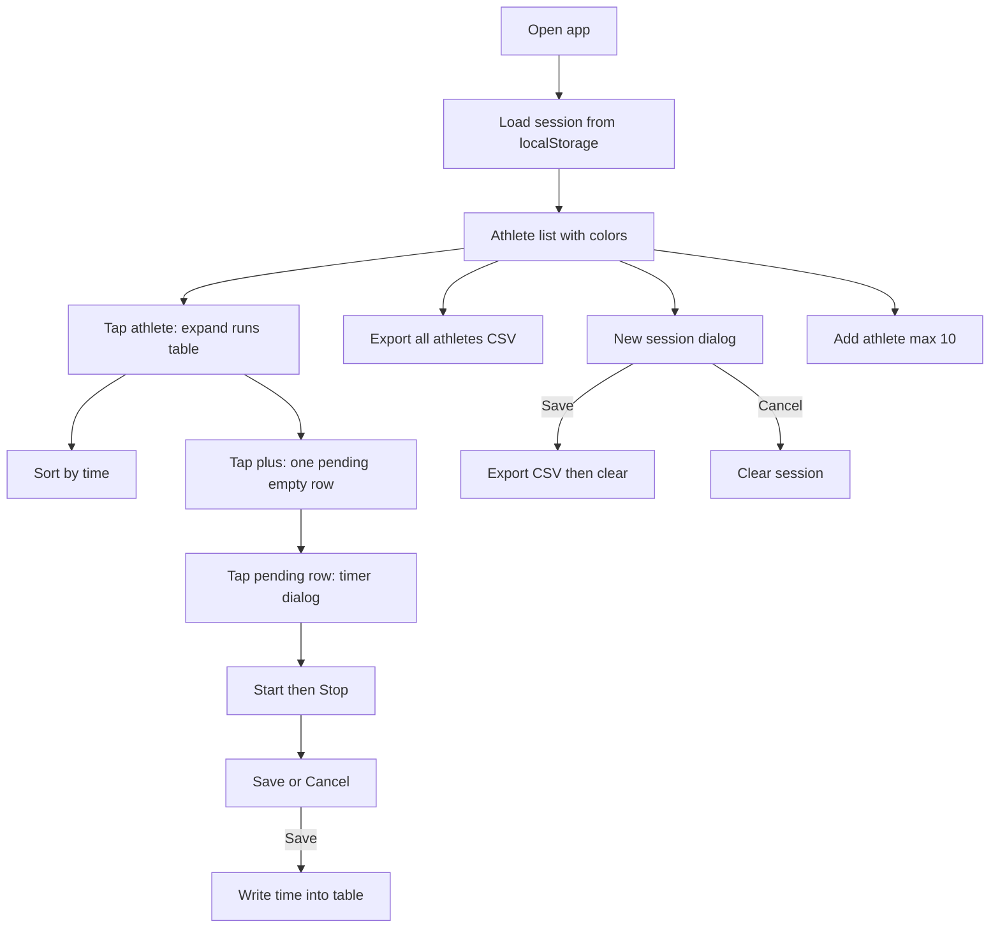

# Climber Speed Timer (Flutter Web + GitHub Pages)

## Scope

Greenfield Flutter **Web** app in [`/home/pv/src/climber-app`](/home/pv/src/climber-app) (repo already points at `https://github.com/pvtvv/climber-app.git`). English UI. No backend. Session data lives in the browser (`localStorage` via `shared_preferences`).

**Out of scope:** speech-to-speech, native mobile, server sync.

## Rule: Definition of Done

Every subtask below is incomplete until its **DoD** checks all pass. Do not start the next subtask until the current DoD is satisfied. Prefer automated checks (`flutter test`, command exit codes) where listed; otherwise use the stated manual Chrome verification.

## Dev environment note

Flutter on this machine is currently `/mnt/c/FlutterSDK/...` with CRLF shebangs (`bash\r`), so it fails under WSL. Before `flutter create`, install a Linux Flutter SDK under WSL (e.g. `~/flutter`) and put it first on `PATH`. Target: Flutter stable, web enabled.

## Product behavior



### Session & athletes

- On launch, restore the last session (athletes + runs) from cache.
- Each athlete has a fixed color from a palette of 10.
- **Add athlete**: one-click; prompt for name; hard cap **10**.
- **New session**: dialog — Save (export CSV, then clear) or Cancel (clear without export).

### Runs table (per athlete)

- Expand/collapse on athlete row.
- Columns: run number, time.
- Sortable by time.
- **+** adds at most one unsaved pending row; another + does nothing until that row is saved or discarded.
- Tap pending row → timer overlay.

### Timer overlay

- Large **Start**, small **Stop**, timer `00:00.00` (or equivalent centisecond display).
- After Start: timer runs; Stop becomes large.
- After Stop: green **Save** / red **Cancel**.
- Save → write time into the pending row and close; Cancel → discard pending row and close.

### CSV

- Export control downloads a summary CSV for **all** athletes (athlete name, run #, time).
- Same export used from New Session → Save.

## Technical approach

### Project bootstrap

1. Fix Flutter SDK for WSL (Linux install).
2. `flutter create . --platforms=web` in the repo (keep existing `.git`; replace the Flutter-repo `.gitignore` with a standard Flutter app `.gitignore`).
3. Dependencies: `shared_preferences`, `csv` (or hand-roll CSV), `universal_html` / `web` for browser file download on web.

### Architecture (simple, no overbuild)

```
lib/
  main.dart
  models/          # Athlete, Run, Session
  services/        # SessionStore, CsvExport
  state/           # SessionController (ChangeNotifier or similar)
  screens/         # HomeScreen
  widgets/         # AthleteTile, RunsTable, TimerDialog, NewSessionDialog
```

- Single `SessionController` owns athletes/runs, pending-row rules, sort, add/clear/export.
- Persist whole session JSON on every meaningful mutation.
- Timer: `Stopwatch` + periodic ticker; display elapsed; no background isolate needed for web.

### GitHub Pages

- Workflow [`.github/workflows/deploy.yml`](.github/workflows/deploy.yml): on push to `main`, `flutter build web --base-href /climber-app/`, upload `build/web`, deploy with `actions/deploy-pages`.
- Set repo Pages source to GitHub Actions.
- README: local run (`flutter run -d chrome`) and live URL.

### UI language & design

- All strings in English.
- Touch-friendly timer controls (large Start/Stop) for phone use in the gym.
- Stay within Flutter Material defaults lightly themed — functional sports timer, not a marketing landing page. Athlete color as the main visual cue in the list.

## Subtasks with Definition of Done

### Bootstrap

#### 1. sdk-install
- **Work:** Install Linux Flutter SDK under WSL (e.g. `~/flutter`); put it first on `PATH`.
- **DoD:**
  - `which flutter` resolves to a Linux path under the home directory (not `/mnt/c/...`).
  - `flutter --version` exits 0 and prints a stable channel version.
  - Command does not fail with `bash\r` / CRLF shebang errors.

#### 2. project-create
- **Work:** `flutter create . --platforms=web` in climber-app; replace Flutter-repo `.gitignore` with a standard Flutter app `.gitignore`; keep `.git`.
- **DoD:**
  - Repo contains `pubspec.yaml`, `lib/main.dart`, and `web/`.
  - `flutter pub get` exits 0.
  - `flutter run -d chrome` launches and shows the default Material counter/shell (or equivalent blank Material app) without build errors.

### Domain (unit-testable, no UI)

#### 3. model-athlete-run
- **Work:** Implement `Athlete`, `Run`, `Session` with `toJson` / `fromJson`.
- **DoD:**
  - `flutter test` includes a test that builds a session with ≥2 athletes and ≥1 run each, serializes to JSON, deserializes, and asserts equal fields (ids, names, color indices, run numbers, times).
  - That test passes.

#### 4. store-persist
- **Work:** `SessionStore` load/save via `shared_preferences` (or equivalent web localStorage wrapper).
- **DoD:**
  - Unit test: start empty → save a non-empty session → load → athletes/runs match what was saved.
  - Unit test: load with no prior data returns an empty session (not null crash).
  - Both tests pass under `flutter test`.

#### 5. controller-athletes
- **Work:** `SessionController.addAthlete(name)` assigns next palette color; `clearSession()` empties athletes/runs; hard cap 10.
- **DoD:**
  - Unit test: adding 10 athletes succeeds; each has a distinct color index from the palette.
  - Unit test: 11th `addAthlete` does not increase count (returns false / no-op) and list length stays 10.
  - Unit test: after `clearSession`, athlete list is empty.
  - All pass under `flutter test`.

#### 6. controller-runs
- **Work:** Pending-row rules, `saveRun`, `discardPending`, `sortByTime`.
- **DoD:**
  - Unit test: first `addPendingRun` creates one pending row; second call while pending exists does not add another.
  - Unit test: `saveRun(duration)` converts pending into a saved run with that time and clears pending.
  - Unit test: `discardPending` removes pending and leaves saved runs unchanged.
  - Unit test: `sortByTime` orders saved runs ascending by duration.
  - All pass under `flutter test`.

### UI — session shell

#### 7. ui-athlete-list
- **Work:** `HomeScreen` shows athletes with their colors; tap expands/collapses; empty state when none.
- **DoD (manual Chrome):**
  - With 0 athletes: empty-state message is visible.
  - With ≥1 seeded/added athlete: name and color cue are visible.
  - Tap athlete → runs area expands; tap again → collapses.

#### 8. ui-add-athlete
- **Work:** One-click add control opens name dialog; creates athlete on confirm.
- **DoD (manual Chrome):**
  - Enter name → confirm → athlete appears in the list with a color.
  - With 10 athletes: add control is disabled or hidden; cannot create an 11th via UI.

#### 9. ui-runs-table
- **Work:** Expanded `RunsTable` shows run number and time; sort-by-time control.
- **DoD (manual Chrome):**
  - Athlete with ≥2 saved runs shows rows with run # and formatted time.
  - Activating sort-by-time reorders rows by ascending time (visually verifiable).

#### 10. ui-pending-plus
- **Work:** `+` adds at most one pending empty row.
- **DoD (manual Chrome):**
  - First tap on `+` adds one empty/pending row.
  - Second tap on `+` while pending exists does not add another row.
  - Pending row is visually distinct from saved runs (e.g. empty time).

### UI — timer

#### 11. ui-timer-start-stop
- **Work:** Tap pending row opens timer dialog with Start, Stop, and `00:00.00` display.
- **DoD (manual Chrome):**
  - Dialog opens showing timer at `00:00.00`, large Start, small Stop.
  - Tap Start → display increments.
  - After Start, Stop is large; tap Stop → display freezes at a non-zero value.

#### 12. ui-timer-save-cancel
- **Work:** After Stop, green Save and red Cancel.
- **DoD (manual Chrome):**
  - Save → dialog closes; pending row becomes a saved run with the stopped time.
  - Repeat flow then Cancel → dialog closes; pending row is gone; no new saved run added.

### Export & session lifecycle

#### 13. csv-export
- **Work:** Export control downloads summary CSV for all athletes.
- **DoD (manual Chrome):**
  - With ≥2 athletes and runs, Export downloads a `.csv` file.
  - File contains header plus rows with athlete name, run number, and time for every saved run.
  - Opening the file in a text editor confirms all athletes’ runs are present.

#### 14. ui-new-session
- **Work:** New Session dialog: Save (export then clear) or Cancel (clear only).
- **DoD (manual Chrome):**
  - Save → CSV download occurs AND athlete list becomes empty.
  - Re-seed data, then Cancel on New Session → list becomes empty AND no new CSV download is triggered by that Cancel action.

#### 15. persist-reload
- **Work:** Persist session on mutation; restore on launch.
- **DoD (manual Chrome):**
  - Add athletes and ≥1 saved run → hard reload (Ctrl+Shift+R).
  - Same athletes, colors, and run times are restored without re-entry.

### Deploy

#### 16. gh-pages-workflow
- **Work:** Add `.github/workflows/deploy.yml` building with `--base-href /climber-app/` and deploying via `actions/deploy-pages`.
- **DoD:**
  - Workflow file exists and references `flutter build web --base-href /climber-app/`.
  - Workflow uses GitHub Pages deploy actions (`upload-pages-artifact` / `deploy-pages` or equivalent).
  - YAML is valid enough to be accepted by GitHub Actions (no obvious syntax errors).

#### 17. gh-pages-verify
- **Work:** Enable Pages (GitHub Actions source); push `main`; document in README.
- **DoD:**
  - Latest `main` push workflow run is green.
  - `https://pvtvv.github.io/climber-app/` loads the app (not 404 / broken asset paths).
  - README documents local run (`flutter run -d chrome`) and the live URL.
