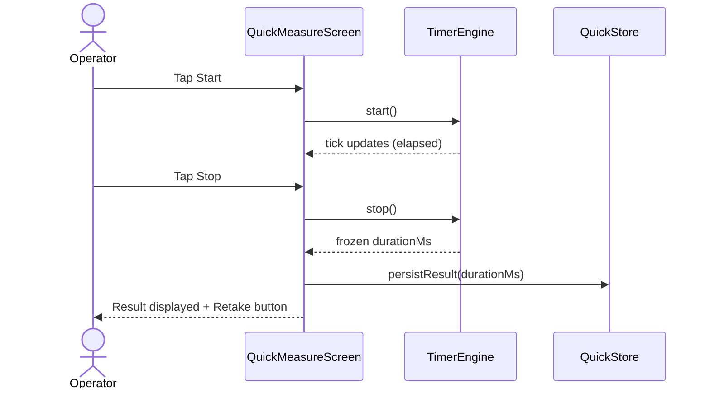
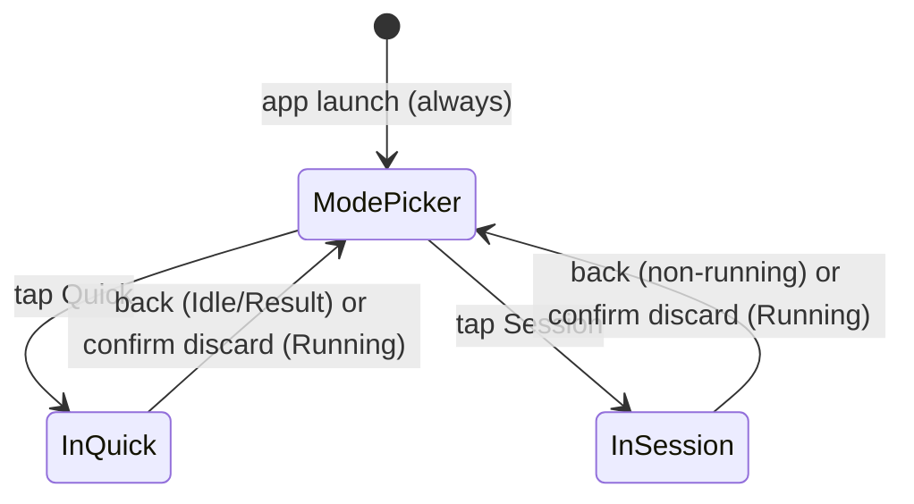
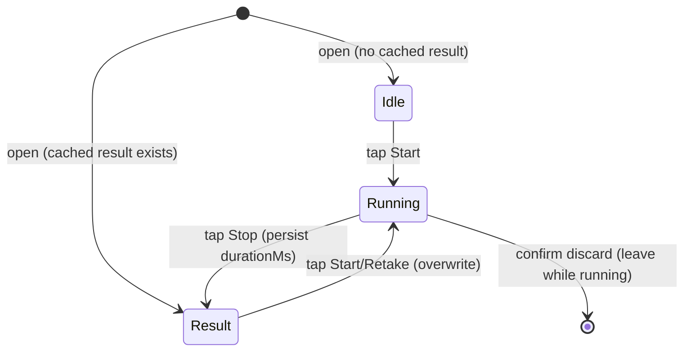

# Feature: Measurement Mode Entry

<!-- toc -->

- [1. Feature Context](#1-feature-context)
  - [1.1 Overview](#11-overview)
  - [1.2 Purpose](#12-purpose)
  - [1.3 Actors](#13-actors)
  - [1.4 References](#14-references)
- [2. Actor Flows (CDSL)](#2-actor-flows-cdsl)
  - [Launch to ModePicker](#launch-to-modepicker)
  - [Enter Quick Mode](#enter-quick-mode)
  - [Quick: Start → Stop → Result](#quick-start--stop--result)
  - [Quick: Retake / Overwrite](#quick-retake--overwrite)
  - [Enter Session Mode](#enter-session-mode)
  - [Leave Mode to ModePicker (AppBar Back)](#leave-mode-to-modepicker-appbar-back)
  - [Leave While Running (Confirm Discard)](#leave-while-running-confirm-discard)
  - [System / Browser Back Parity](#system--browser-back-parity)
- [3. Processes / Business Logic (CDSL)](#3-processes--business-logic-cdsl)
  - [Resolve Measurement Mode / ModePicker Presentation](#resolve-measurement-mode--modepicker-presentation)
  - [Load Quick Result Store](#load-quick-result-store)
  - [Persist Quick Result on Stop](#persist-quick-result-on-stop)
  - [Lazy-Load Session Store on Session Enter](#lazy-load-session-store-on-session-enter)
  - [Shared Timer Engine Tick and Phases](#shared-timer-engine-tick-and-phases)
- [4. States (CDSL)](#4-states-cdsl)
  - [App Entry / ModePicker vs In-Mode](#app-entry--modepicker-vs-in-mode)
  - [Quick Measure UI Phase State Machine](#quick-measure-ui-phase-state-machine)
  - [Session TimerDialog Phases (Cross-Reference)](#session-timerdialog-phases-cross-reference)
- [5. Definitions of Done](#5-definitions-of-done)
  - [ModePicker Always on Launch](#modepicker-always-on-launch)
  - [Quick and Session Labels and Copy](#quick-and-session-labels-and-copy)
  - [Isolated Storage Keys](#isolated-storage-keys)
  - [QuickMeasureScreen Full-Screen Surface](#quickmeasurescreen-full-screen-surface)
  - [Persist Quick Result Immediately on Stop](#persist-quick-result-immediately-on-stop)
  - [Quick Retake Overwrites Cached Result](#quick-retake-overwrites-cached-result)
  - [AppBar and System Back Navigation](#appbar-and-system-back-navigation)
  - [Confirm Leave While Running](#confirm-leave-while-running)
  - [Session Feature Parity](#session-feature-parity)
  - [Shared Timer Engine Extract with Session Regression Bar](#shared-timer-engine-extract-with-session-regression-bar)
  - [Lazy-Load Mode Store on Enter](#lazy-load-mode-store-on-enter)
- [6. Acceptance Criteria](#6-acceptance-criteria)
- [7. Traceability](#7-traceability)

<!-- /toc -->

- [x] `p1` - **ID**: `cpt-climberapp-featstatus-measurement-mode-entry`
## 1. Feature Context

### 1.1 Overview

Measurement Mode Entry adds a **ModePicker** home screen to Climber Speed Timer, giving the operator two peer measurement modes:

- **Quick** — one timer, one cached result; Start → Stop shows the result and persists it immediately; Retake overwrites.
- **Session** — the existing multi-athlete roster/run/CSV flow. In-mode behavior (athlete roster, TimerDialog Save/Cancel, run persistence, CSV export) is unchanged. The only additive changes are the AppBar back arrow to ModePicker and the leave-while-running confirmation guard. Note: `climber_session_v1` hydration is moved from app start to the first Session entry by this feature's lazy-load architecture (see `cpt-climberapp-algo-measurement-mode-entry-lazy-load-session-store`); this supersedes the resume-on-launch load timing defined in `climberapp-session-timer` while leaving all in-mode behavior intact.

ModePicker is the `MaterialApp` home and is always shown on launch. Each mode's storage is isolated: entering one mode never reads or clears the other mode's persisted data. A shared timer engine (phases + tick) is extracted from the current `TimerDialog` implementation so both surfaces can reuse it without duplicating timing logic.

### 1.2 Purpose

This feature exists to let the timer operator choose at launch whether they need a quick single-result measurement or a full multi-athlete session, without losing the state of either mode when switching between them. All storage is local browser persistence; no backend or network calls are involved.

**Requirements**: No PRD exists yet for ClimberApp, so FR / NFR requirement IDs cannot be cited (gap — see Section 7 Traceability).

**Principles**: No DESIGN exists yet for ClimberApp, so principle IDs cannot be cited (gap — see Section 7 Traceability).

### 1.3 Actors

| Actor                                 | Role in Feature                                                                                                                                                                                                                                                                    |
| ------------------------------------- | ---------------------------------------------------------------------------------------------------------------------------------------------------------------------------------------------------------------------------------------------------------------------------------- |
| Timer operator | Chooses a measurement mode at launch, operates the Quick timer or the Session roster, navigates back to ModePicker via the AppBar, and responds to leave-while-running confirmation dialogs. This is the single, undifferentiated operator role found across the ClimberApp UI; no authentication or role model exists. When a PRD is authored, the shared actor ID used by Session Timer should be cited here (gap — see Section 7 Traceability). |

### 1.4 References

- **PRD**: Not yet authored for ClimberApp (gap — see Section 7 Traceability). This FEATURE was authored from locked brainstorm decisions in `.cf-studio/.cache/brainstorm/quick-session-mode-ui-2026-07-28T062803Z/state.json` and `design.md`.
- **Design**: Not yet authored for ClimberApp (gap — see Section 7 Traceability).
- **Dependencies**:
  - **Depends on** `climberapp-session-timer` FEATURE for all Session-mode internals: athlete roster, TimerDialog, run lifecycle, Save/Cancel, CSV export, and `climber_session_v1` persistence. This FEATURE does not redefine those behaviors.
  - This FEATURE **owns**: ModePicker, Quick mode (QuickMeasureScreen, `climber_quick_v1` store, persist-on-stop, retake), navigation/leave rules (AppBar back, leave-while-running, system back parity), storage isolation between modes, and the shared timer engine extraction requirement.

## 2. Actor Flows (CDSL)

User-facing interactions that start with the timer operator and describe the end-to-end flow of a use case.

**Use cases**: No PRD-level use-case catalog exists yet for ClimberApp (gap — see Section 7 Traceability); the flows below are derived from locked brainstorm decisions.

### Launch to ModePicker

- [x] `p1` - **ID**: `cpt-climberapp-flow-measurement-mode-entry-launch-to-picker`

**Actor**: Timer operator

**Success Scenarios**:

- Operator opens the app; ModePicker is displayed with Quick and Session choices, regardless of whether a previous session or quick result exists in local storage.

**Steps**:

1. [x] - `p1` - App starts; system executes algorithm: resolve measurement mode using `cpt-climberapp-algo-measurement-mode-entry-resolve-picker-presentation` - `inst-launch-resolve-picker`
2. [x] - `p1` - System renders ModePicker as the root route with two selectable tiles: **Quick** ("One timer. One result.") and **Session** ("Multiple athletes. Track runs.") - `inst-launch-render-picker`
3. [x] - `p1` - **RETURN** ModePicker displayed; operator may tap either tile - `inst-launch-return-picker`

### Enter Quick Mode

- [x] `p1` - **ID**: `cpt-climberapp-flow-measurement-mode-entry-enter-quick`

**Actor**: Timer operator

**Success Scenarios**:

- Operator taps Quick on ModePicker; QuickMeasureScreen opens full-screen showing any previously cached result (or an idle state if none exists).

**Steps**:

1. [x] - `p1` - Operator taps the **Quick** tile on ModePicker - `inst-enter-quick-tap`
2. [x] - `p1` - Algorithm: load Quick result store using `cpt-climberapp-algo-measurement-mode-entry-load-quick-store` - `inst-enter-quick-load-store`
3. [x] - `p1` - System pushes QuickMeasureScreen onto the navigator as a full-screen route with an AppBar back arrow pointing to ModePicker - `inst-enter-quick-push-screen`
4. [x] - `p1` - **IF** a cached Quick result exists in `climber_quick_v1` - `inst-enter-quick-if-cached`
  1. [x] - `p1` - System displays the cached result in the Result state - `inst-enter-quick-show-cached`
5. [x] - `p1` - **ELSE** - `inst-enter-quick-else`
  1. [x] - `p1` - System displays QuickMeasureScreen in the Idle state - `inst-enter-quick-show-idle`
6. [x] - `p1` - **RETURN** QuickMeasureScreen shown in the appropriate phase - `inst-enter-quick-return`

### Quick: Start → Stop → Result

- [x] `p1` - **ID**: `cpt-climberapp-flow-measurement-mode-entry-quick-start-stop-result`

**Actor**: Timer operator

**Success Scenarios**:

- Operator taps Start on QuickMeasureScreen; timer runs; operator taps Stop; result is displayed immediately and written to `climber_quick_v1` without any Save/Cancel step.

**Steps**:

1. [x] - `p1` - Operator is on QuickMeasureScreen in Idle state; taps **Start** - `inst-quick-tap-start`
2. [x] - `p1` - Shared timer engine (via `cpt-climberapp-algo-measurement-mode-entry-timer-engine`) transitions to Running; elapsed display begins updating at the fixed tick interval - `inst-quick-running`
3. [x] - `p1` - Operator taps **Stop** - `inst-quick-tap-stop`
4. [x] - `p1` - Shared timer engine transitions to Result; elapsed display freezes at the captured duration - `inst-quick-freeze-elapsed`
5. [x] - `p1` - Algorithm: persist Quick result on stop using `cpt-climberapp-algo-measurement-mode-entry-persist-quick-result` - `inst-quick-persist`
6. [x] - `p1` - System displays the result on QuickMeasureScreen with a **Start** (Retake) button; no Save/Cancel controls are shown - `inst-quick-show-result`
7. [x] - `p1` - **RETURN** result visible and persisted in `climber_quick_v1` - `inst-quick-return-result`

*Diagram rationale*: this flow spans three collaborating units (`QuickMeasureScreen`, `TimerEngine`, `QuickStore`) and involves a persist side-effect on stop; a sequence diagram is warranted to make the boundary clear.

### Quick: Retake / Overwrite

- [x] `p1` - **ID**: `cpt-climberapp-flow-measurement-mode-entry-quick-retake`

**Actor**: Timer operator

**Success Scenarios**:

- Operator taps Start / Retake while a previous result is displayed; a new timing run begins and, when stopped, overwrites the previously cached result.

**Steps**:

1. [x] - `p1` - Operator is on QuickMeasureScreen in Result state; taps **Start** (Retake) - `inst-retake-tap`
2. [x] - `p1` - System transitions QuickMeasureScreen to Idle, then immediately to Running — no confirmation is required - `inst-retake-idle-to-running`
3. [x] - `p1` - Follow steps 2–7 of `cpt-climberapp-flow-measurement-mode-entry-quick-start-stop-result`; the persist step overwrites the previously stored result in `climber_quick_v1` - `inst-retake-overwrite`
4. [x] - `p1` - **RETURN** new result displayed; prior result is no longer accessible - `inst-retake-return`

### Enter Session Mode

- [x] `p1` - **ID**: `cpt-climberapp-flow-measurement-mode-entry-enter-session`

**Actor**: Timer operator

**Success Scenarios**:

- Operator taps Session on ModePicker; the existing Session HomeScreen opens and the full Session feature set (athlete roster, run timing, CSV export) is available.

**Steps**:

1. [x] - `p1` - Operator taps the **Session** tile on ModePicker - `inst-enter-session-tap`
2. [x] - `p1` - Algorithm: lazy-load Session store using `cpt-climberapp-algo-measurement-mode-entry-lazy-load-session-store` — reads `climber_session_v1`; Quick store (`climber_quick_v1`) is not touched - `inst-enter-session-load-store`
3. [x] - `p1` - System pushes the Session HomeScreen onto the navigator with an AppBar back arrow pointing to ModePicker - `inst-enter-session-push-screen`
4. [x] - `p1` - **RETURN** Session HomeScreen displayed with all Session-mode behavior as defined in `climberapp-session-timer` FEATURE - `inst-enter-session-return`

### Leave Mode to ModePicker (AppBar Back)

- [x] `p1` - **ID**: `cpt-climberapp-flow-measurement-mode-entry-leave-to-picker`

**Actor**: Timer operator

**Success Scenarios**:

- Operator taps the AppBar back arrow from QuickMeasureScreen or Session HomeScreen while not in Running state; ModePicker is shown and the mode's store is not cleared.

**Error Scenarios**:

- Operator attempts to leave while the timer is Running (handled by `cpt-climberapp-flow-measurement-mode-entry-leave-while-running`; this flow covers the non-running case only).

**Steps**:

1. [x] - `p1` - Operator taps the AppBar back arrow from QuickMeasureScreen or Session HomeScreen - `inst-leave-tap-back`
2. [x] - `p1` - **IF** the timer engine is in Running state - `inst-leave-if-running`
  1. [x] - `p1` - Redirect to `cpt-climberapp-flow-measurement-mode-entry-leave-while-running` - `inst-leave-redirect-confirm`
3. [x] - `p1` - **ELSE** (Idle or Result state in Quick; Idle or Stopped in Session) - `inst-leave-else`
  1. [x] - `p1` - System pops the current route; ModePicker becomes the active screen - `inst-leave-pop-to-picker`
  2. [x] - `p1` - The departed mode's in-memory store is retained (not unloaded or cleared) - `inst-leave-retain-store`
  3. [x] - `p1` - **RETURN** ModePicker displayed - `inst-leave-return-picker`

### Leave While Running (Confirm Discard)

- [x] `p1` - **ID**: `cpt-climberapp-flow-measurement-mode-entry-leave-while-running`

**Actor**: Timer operator

**Success Scenarios**:

- Operator confirms leave; in-progress timing is discarded and ModePicker is shown.

**Error Scenarios**:

- Operator dismisses the confirmation dialog; the timer resumes from its current Running state and ModePicker is not shown.

**Steps**:

1. [x] - `p1` - Timer engine is in Running state when a leave gesture is received (AppBar back or system back) - `inst-lwrunning-trigger`
2. [x] - `p1` - System pauses the timer display and shows a confirmation dialog: "Leave? Your in-progress timing will be discarded." with **Leave** and **Cancel** actions - `inst-lwrunning-show-confirm`
3. [x] - `p1` - **IF** operator taps **Leave** - `inst-lwrunning-if-leave`
  1. [x] - `p1` - System discards the in-progress timing and pops the current route to ModePicker - `inst-lwrunning-discard-pop`
  2. [x] - `p1` - The previously persisted Quick result (if any) is not affected by the discard - `inst-lwrunning-preserve-cached`
  3. [x] - `p1` - **RETURN** ModePicker displayed; in-progress timing lost - `inst-lwrunning-return-left`
4. [x] - `p1` - **ELSE** (operator taps **Cancel** or dismisses the dialog) - `inst-lwrunning-else`
  1. [x] - `p1` - System closes the dialog; the timer resumes Running - `inst-lwrunning-resume`
  2. [x] - `p1` - **RETURN** operator continues timing on the same screen - `inst-lwrunning-return-resumed`

### System / Browser Back Parity

- [x] `p1` - **ID**: `cpt-climberapp-flow-measurement-mode-entry-system-back-parity`

**Actor**: Timer operator

**Success Scenarios**:

- Pressing the browser back button or the device hardware back while on QuickMeasureScreen or Session HomeScreen behaves identically to tapping the AppBar back arrow.

**Steps**:

1. [x] - `p1` - Operator presses the browser/system back while on QuickMeasureScreen or Session HomeScreen - `inst-sysback-trigger`
2. [x] - `p1` - System intercepts the back gesture and applies the same policy as the AppBar back arrow - `inst-sysback-intercept`
3. [x] - `p1` - **IF** the timer engine is in Running state - `inst-sysback-if-running`
  1. [x] - `p1` - Execute `cpt-climberapp-flow-measurement-mode-entry-leave-while-running` - `inst-sysback-confirm`
4. [x] - `p1` - **ELSE** - `inst-sysback-else`
  1. [x] - `p1` - Pop the current route to ModePicker - `inst-sysback-pop`
5. [x] - `p1` - **RETURN** navigation consistent with AppBar behavior; no URL deep links are exposed in v1 - `inst-sysback-return`

## 3. Processes / Business Logic (CDSL)

Internal algorithms called by the actor flows above; they do not interact with the operator directly.

### Resolve Measurement Mode / ModePicker Presentation

- [x] `p2` - **ID**: `cpt-climberapp-algo-measurement-mode-entry-resolve-picker-presentation`

**Input**: none (called at app startup before any route is pushed)

**Output**: the initial route to render (`ModePicker`)

**Steps**:

1. [x] - `p1` - On every app launch, resolve the initial route to `ModePicker` regardless of previously entered mode or cached results - `inst-resolve-picker-always`
2. [x] - `p1` - Set `ModePicker` as the `MaterialApp` home widget so it is the root of the navigator stack - `inst-resolve-picker-home`
3. [x] - `p1` - **RETURN** `ModePicker` as the active screen - `inst-resolve-picker-return`

Note: no stored "last mode" preference is read; ModePicker is unconditionally shown (decision: `mode_picker_on_launch`).

### Load Quick Result Store

- [x] `p2` - **ID**: `cpt-climberapp-algo-measurement-mode-entry-load-quick-store`

**Input**: browser local storage

**Output**: a `QuickResult` record (duration in milliseconds + timestamp), or `null` if no result is cached

**Steps**:

1. [x] - `p1` - Read the value stored under key `climber_quick_v1` from browser local storage - `inst-load-quick-read`
2. [x] - `p1` - **IF** no value exists or the value fails to parse - `inst-load-quick-if-missing`
  1. [x] - `p1` - **RETURN** `null` (QuickMeasureScreen enters Idle state) - `inst-load-quick-return-null`
3. [x] - `p1` - **ELSE** - `inst-load-quick-else`
  1. [x] - `p1` - Decode the JSON record into a `QuickResult` - `inst-load-quick-decode`
  2. [x] - `p1` - **RETURN** the decoded `QuickResult` (QuickMeasureScreen enters Result state) - `inst-load-quick-return-result`

The `climber_session_v1` key is not read or touched during this algorithm (decision: `mode_storage_isolation`).

### Persist Quick Result on Stop

- [x] `p2` - **ID**: `cpt-climberapp-algo-measurement-mode-entry-persist-quick-result`

**Input**: captured duration in milliseconds, current wall-clock timestamp

**Output**: confirmation that the result is durable in browser local storage

**Steps**:

1. [x] - `p1` - Encode a `QuickResult` record with the given duration and timestamp as JSON - `inst-persist-quick-encode`
2. [x] - `p1` - Write the encoded value to browser local storage under key `climber_quick_v1`, overwriting any previously stored value - `inst-persist-quick-write`
3. [x] - `p1` - **RETURN** persisted - `inst-persist-quick-return`

Note: no Save/Cancel gate exists for Quick mode; persistence happens immediately on Stop (decision: `plain_post_stop`).

**Write-error behavior**: Browser local storage writes may fail (e.g. storage quota exceeded or private-browsing restrictions). If the write fails, the captured result is still displayed on-screen for the current session; no retry UI or error notification is shown to the operator, and no backend retry is possible (client-side only bundle). The previously stored value (if any) is not modified by a failed write. Guaranteed durable persistence on write failure, and any user-visible error state, are deferred — no explicit error-recovery UI is implemented in v1 (acceptance gap).

### Lazy-Load Session Store on Session Enter

- [x] `p2` - **ID**: `cpt-climberapp-algo-measurement-mode-entry-lazy-load-session-store`

**Input**: browser local storage

**Output**: a loaded `Session` record (delegated to the Session-mode store) made available to the Session HomeScreen

**Steps**:

1. [x] - `p1` - On the first enter into Session mode, read `climber_session_v1` from browser local storage; delegate pending-run sanitization to `cpt-climberapp-algo-session-timer-recover-pending-on-load` before hydrating the in-memory Session controller - `inst-lazy-session-load`
2. [x] - `p1` - **IF** subsequent enters occur within the same app lifecycle without a reload - `inst-lazy-session-subsequent`
  1. [x] - `p1` - Reuse the already-hydrated in-memory Session controller without re-reading storage - `inst-lazy-session-reuse`
3. [x] - `p1` - `climber_quick_v1` is not read or modified during this algorithm - `inst-lazy-session-no-quick`
4. [x] - `p1` - Leaving Session mode via AppBar back does not clear the in-memory Session controller (decision: `mode_load_lifecycle`) - `inst-lazy-session-no-unload`
5. [x] - `p1` - **RETURN** Session store ready - `inst-lazy-session-return`

**Loading-state behavior**: The Session store read is performed via `await controller.load()` (which calls `SharedPreferences.getInstance()` followed by `getString`) — this is an async/await call, not a synchronous one. The Session HomeScreen is pushed only after the await completes; no loading spinner or skeleton UI is shown in v1 while the load is in flight. If a slow-storage scenario requires an explicit loading indicator in a future version, a loading-state UI MUST be defined and documented at that time (deferred; explicit loading-state UI is an acceptance gap in v1).

### Shared Timer Engine Tick and Phases

- [x] `p2` - **ID**: `cpt-climberapp-algo-measurement-mode-entry-timer-engine`

**Input**: a `start()` or `stop()` command issued by either QuickMeasureScreen or TimerDialog

**Output**: elapsed duration in milliseconds on stop; periodic tick callbacks while Running

**Steps**:

1. [x] - `p1` - The timer engine is a standalone Dart unit extracted from the current `TimerDialog` implementation, exposing: `start()`, `stop()`, a tick stream (fixed interval, centisecond precision), and the frozen `durationMs` on stop - `inst-engine-contract`
2. [x] - `p1` - **ON** `start()`: record the start wall-clock time and begin emitting tick events at the fixed interval - `inst-engine-start`
3. [x] - `p1` - **ON** each tick: compute `elapsed = now − startTime`; emit the elapsed value to the subscriber (QuickMeasureScreen or TimerDialog) - `inst-engine-tick`
4. [x] - `p1` - **ON** `stop()`: stop the tick stream; freeze `durationMs = elapsed at stop instant` - `inst-engine-stop`
5. [x] - `p1` - **RETURN** frozen `durationMs` to the calling UI layer - `inst-engine-return`
6. [x] - `p2` - The engine is shared but each screen instance owns its own engine object; there is no global singleton timer - `inst-engine-per-instance`

Session TimerDialog continues to pass `durationMs` through its existing `int?` return barrier and present Save/Cancel to the operator (decision: `session_timer_regression_bar`). QuickMeasureScreen bypasses Save/Cancel entirely; it passes `durationMs` directly to `cpt-climberapp-algo-measurement-mode-entry-persist-quick-result`.

## 4. States (CDSL)

### App Entry / ModePicker vs In-Mode

- [x] `p2` - **ID**: `cpt-climberapp-state-measurement-mode-entry-app-nav`

**States**: `ModePicker`, `InQuick`, `InSession`

**Initial State**: `ModePicker` (unconditional on every app launch)

**Transitions**:

1. [x] - `p1` - **FROM** `ModePicker` **TO** `InQuick` **WHEN** operator taps the Quick tile - `inst-nav-picker-to-quick`
2. [x] - `p1` - **FROM** `ModePicker` **TO** `InSession` **WHEN** operator taps the Session tile - `inst-nav-picker-to-session`
3. [x] - `p1` - **FROM** `InQuick` **TO** `ModePicker` **WHEN** operator leaves Quick mode and the leave is confirmed (Idle or Result) or confirmed via discard (Running) - `inst-nav-quick-to-picker`
4. [x] - `p1` - **FROM** `InSession` **TO** `ModePicker` **WHEN** operator leaves Session mode and the leave is confirmed - `inst-nav-session-to-picker`

### Quick Measure UI Phase State Machine

- [x] `p2` - **ID**: `cpt-climberapp-state-measurement-mode-entry-quick-phase`

**States**: `Idle`, `Running`, `Result`

**Initial State**: `Idle` (or `Result` if a cached `QuickResult` exists in `climber_quick_v1` when QuickMeasureScreen opens)

**Transitions**:

1. [x] - `p1` - **FROM** `Idle` **TO** `Running` **WHEN** operator taps Start - `inst-quick-phase-idle-to-running`
2. [x] - `p1` - **FROM** `Running` **TO** `Result` **WHEN** operator taps Stop; result is persisted immediately as part of this transition - `inst-quick-phase-running-to-result`
3. [x] - `p1` - **FROM** `Result` **TO** `Running` **WHEN** operator taps Start (Retake); no confirmation required - `inst-quick-phase-result-to-running`
4. [x] - `p1` - **FROM** `Running` **TO** `ModePicker` **WHEN** operator confirms leave while running (discard); timer engine is halted without persisting - `inst-quick-phase-running-discard`

This phase state is scoped to one `QuickMeasureScreen` instance and is not persisted. On re-enter from ModePicker a new instance opens and initialises to `Idle` or `Result` based on `climber_quick_v1`.

### Session TimerDialog Phases (Cross-Reference)

- [x] `p2` - **ID**: `cpt-climberapp-state-measurement-mode-entry-session-dialog-xref`

The Session `TimerDialog` phase state machine (`Idle` → `Running` → `Stopped`, with Save/Cancel on Stopped) is defined in `cpt-climberapp-state-session-timer-timer-phase` in the `climberapp-session-timer` FEATURE. This FEATURE does not redefine it. The only change to Session mode is the additive AppBar back (and the leave-while-running guard) described in Section 2; the `TimerDialog` itself is behavior-preserving (decision: `session_timer_regression_bar`).

## 5. Definitions of Done

### ModePicker Always on Launch

- [x] `p1` - **ID**: `cpt-climberapp-dod-measurement-mode-entry-picker-on-launch`

The system **MUST** present ModePicker as the first screen on every app launch, with no "last mode" memory or bypass.

**Implements**:

- `cpt-climberapp-flow-measurement-mode-entry-launch-to-picker`
- `cpt-climberapp-algo-measurement-mode-entry-resolve-picker-presentation`

**Constraints**: None cited (gap — see Section 7 Traceability).

**Touches**:

- UI: `ModePicker` widget (new); set as `MaterialApp` home in `lib/main.dart`
- Route: root navigator entry; no stored preference read

### Quick and Session Labels and Copy

- [x] `p1` - **ID**: `cpt-climberapp-dod-measurement-mode-entry-labels-and-copy`

The system **MUST** display the mode picker tiles with the user-facing names **Quick** and **Session**, using the exact subtitle copy: Quick — "One timer. One result."; Session — "Multiple athletes. Track runs."

**Implements**:

- `cpt-climberapp-flow-measurement-mode-entry-launch-to-picker`

**Constraints**: None cited (gap — see Section 7 Traceability).

**Touches**:

- UI: `ModePicker` widget; string constants for tile labels and subtitles

### Isolated Storage Keys

- [x] `p1` - **ID**: `cpt-climberapp-dod-measurement-mode-entry-storage-isolation`

The system **MUST** store Quick results exclusively under `climber_quick_v1` and Session data exclusively under `climber_session_v1`. Entering one mode **MUST NOT** read, overwrite, or clear the other mode's storage key.

**Implements**:

- `cpt-climberapp-algo-measurement-mode-entry-load-quick-store`
- `cpt-climberapp-algo-measurement-mode-entry-persist-quick-result`
- `cpt-climberapp-algo-measurement-mode-entry-lazy-load-session-store`

**Constraints**: None cited (gap — see Section 7 Traceability).

**Touches**:

- DB: Browser local storage keys `climber_quick_v1` (Quick) and `climber_session_v1` (Session)
- Entities: `QuickResult` (new), `Session` (existing)

### QuickMeasureScreen Full-Screen Surface

- [x] `p1` - **ID**: `cpt-climberapp-dod-measurement-mode-entry-quick-full-screen`

The system **MUST** implement Quick mode as a dedicated full-screen `QuickMeasureScreen` widget, not as a dialog or sheet overlaying another screen. It **MUST** include an AppBar with a back arrow.

**Implements**:

- `cpt-climberapp-flow-measurement-mode-entry-enter-quick`

**Constraints**: None cited (gap — see Section 7 Traceability).

**Touches**:

- UI: `QuickMeasureScreen` widget (new) under `lib/screens/`
- Route: pushed by `ModePicker` navigator; full-screen scaffold

### Persist Quick Result Immediately on Stop

- [x] `p1` - **ID**: `cpt-climberapp-dod-measurement-mode-entry-persist-on-stop`

The system **MUST** write the captured `durationMs` and timestamp to `climber_quick_v1` immediately when the operator taps Stop on QuickMeasureScreen. No Save/Cancel confirmation gate is presented.

**Implements**:

- `cpt-climberapp-flow-measurement-mode-entry-quick-start-stop-result`
- `cpt-climberapp-algo-measurement-mode-entry-persist-quick-result`

**Constraints**: None cited (gap — see Section 7 Traceability).

**Touches**:

- DB: Browser local storage key `climber_quick_v1`
- Entities: `QuickResult`

### Quick Retake Overwrites Cached Result

- [x] `p1` - **ID**: `cpt-climberapp-dod-measurement-mode-entry-retake`

The system **MUST** allow the operator to start a new timing run from the Result state by tapping Start (Retake). The new result **MUST** overwrite the previously cached `climber_quick_v1` value on Stop. No history list of past Quick results is kept.

**Implements**:

- `cpt-climberapp-flow-measurement-mode-entry-quick-retake`
- `cpt-climberapp-algo-measurement-mode-entry-persist-quick-result`

**Constraints**: None cited (gap — see Section 7 Traceability).

**Touches**:

- DB: Browser local storage key `climber_quick_v1` (overwrite, not append)
- Entities: `QuickResult`

### AppBar and System Back Navigation

- [x] `p1` - **ID**: `cpt-climberapp-dod-measurement-mode-entry-back-nav`

The system **MUST** place an AppBar back arrow on both QuickMeasureScreen and Session HomeScreen that pops the route to ModePicker. The browser/system back gesture **MUST** be intercepted and apply the same policy as the AppBar back arrow. No URL deep links into individual modes are exposed in v1.

**Implements**:

- `cpt-climberapp-flow-measurement-mode-entry-leave-to-picker`
- `cpt-climberapp-flow-measurement-mode-entry-system-back-parity`

**Constraints**: None cited (gap — see Section 7 Traceability).

**Touches**:

- UI: AppBar `leading` back widget on `QuickMeasureScreen` and `HomeScreen`; `PopScope` / `WillPopScope` intercept for browser/system back

### Confirm Leave While Running

- [x] `p1` - **ID**: `cpt-climberapp-dod-measurement-mode-entry-confirm-leave-running`

The system **MUST** show a confirmation dialog when a back gesture (AppBar or system) is received while the timer engine is in Running state, offering **Leave** (discards timing, pops to ModePicker) and **Cancel** (resumes timing, stays on screen). The previously persisted Quick result (if any) **MUST NOT** be affected by a discard.

**Implements**:

- `cpt-climberapp-flow-measurement-mode-entry-leave-while-running`

**Constraints**: None cited (gap — see Section 7 Traceability).

**Touches**:

- UI: Confirmation dialog widget (new or inline); applicable to both `QuickMeasureScreen` and `HomeScreen` when timer is running

### Session Feature Parity

- [x] `p1` - **ID**: `cpt-climberapp-dod-measurement-mode-entry-session-parity`

The Session HomeScreen **MUST** retain full feature parity with the existing Session Timer FEATURE (`climberapp-session-timer`). The only changes to Session mode are additive: the AppBar back arrow to ModePicker and the leave-while-running confirmation guard. No Session-mode functionality (athlete roster, TimerDialog Save/Cancel, CSV export, run persistence under `climber_session_v1`) is altered.

**Load-timing qualification**: `climber_session_v1` hydration is moved from app start to first Session entry by this feature's lazy-load mechanism (`cpt-climberapp-algo-measurement-mode-entry-lazy-load-session-store`). The resume-on-launch timing described in `climberapp-session-timer` (`cpt-climberapp-flow-session-timer-resume-session`) is superseded in this regard; all in-mode behavior defined by that feature document remains authoritative and unchanged.

**Implements**:

- `cpt-climberapp-flow-measurement-mode-entry-enter-session`

**Constraints**: None cited (gap — see Section 7 Traceability).

**Touches**:

- UI: `HomeScreen` — additive AppBar back only; existing widgets and controllers unchanged
- Regression bar: `test/ui_flows_test.dart` (all existing Session tests must remain green)

### Shared Timer Engine Extract with Session Regression Bar

- [x] `p1` - **ID**: `cpt-climberapp-dod-measurement-mode-entry-shared-timer-engine`

The system **MUST** extract a shared timer engine (phases + centisecond tick) from the current `TimerDialog` implementation so that both `QuickMeasureScreen` and `TimerDialog` can use it. The extracted engine **MUST NOT** alter the observable behavior of `TimerDialog` (Save/Cancel barrier, `int?` return value, Idle → Running → Stopped phases).

**Implements**:

- `cpt-climberapp-algo-measurement-mode-entry-timer-engine`

**Constraints**: None cited (gap — see Section 7 Traceability).

**Touches**:

- Code: New timer engine unit under `lib/widgets/` or `lib/services/` (e.g. `timer_engine.dart`)
- Code: Refactored `lib/widgets/timer_dialog.dart` delegates tick/phase logic to the shared engine
- Code: New `lib/screens/quick_measure_screen.dart` uses the same engine
- Regression bar: `test/ui_flows_test.dart` (Session TimerDialog behavior unchanged)

### Lazy-Load Mode Store on Enter

- [x] `p1` - **ID**: `cpt-climberapp-dod-measurement-mode-entry-lazy-load`

The system **MUST** load each mode's store only on the first enter into that mode within an app lifecycle. Leaving a mode via ModePicker **MUST NOT** clear or unload the in-memory store. Entering one mode **MUST NOT** trigger a read of the other mode's storage key.

**Implements**:

- `cpt-climberapp-algo-measurement-mode-entry-load-quick-store`
- `cpt-climberapp-algo-measurement-mode-entry-lazy-load-session-store`

**Constraints**: None cited (gap — see Section 7 Traceability).

**Touches**:

- Code: Mode controller initialization gated on first-enter flag
- DB: `climber_quick_v1` read only on Quick first-enter; `climber_session_v1` read only on Session first-enter

## 6. Acceptance Criteria

- [x] ModePicker is displayed on every launch; no screen other than ModePicker appears before the operator makes a mode selection
- [x] ModePicker tiles show the labels **Quick** and **Session** with the correct subtitle copy ("One timer. One result." / "Multiple athletes. Track runs.")
- [x] Tapping Quick pushes a full-screen `QuickMeasureScreen` with an AppBar back arrow; tapping Session pushes the existing `HomeScreen` with an AppBar back arrow
- [x] On QuickMeasureScreen with no cached result, the screen starts in Idle state (no result shown)
- [x] On QuickMeasureScreen with a cached result, the screen opens in Result state displaying the cached result
- [x] Start → Stop on QuickMeasureScreen shows the result without a Save/Cancel dialog and writes the result to `climber_quick_v1`
- [x] Tapping Start (Retake) from the Result state begins a new timing run; the new result on Stop overwrites the previously cached value in `climber_quick_v1`; no history list is shown
- [x] AppBar back from QuickMeasureScreen (Idle or Result) pops to ModePicker without clearing `climber_quick_v1`
- [x] AppBar back from Session HomeScreen (non-running) pops to ModePicker without clearing `climber_session_v1`
- [x] Browser/system back from either mode screen applies the same back policy as the AppBar back arrow
- [x] Tapping AppBar back or pressing system back while the timer is Running shows a confirmation dialog; tapping **Leave** discards timing and navigates to ModePicker; tapping **Cancel** resumes timing
- [x] After a confirmed discard from Running state, any previously persisted Quick result in `climber_quick_v1` remains unchanged
- [x] Entering Session mode does not read or modify `climber_quick_v1`; entering Quick mode does not read or modify `climber_session_v1`
- [x] All existing `test/ui_flows_test.dart` tests pass without modification after the shared timer engine extraction

## 7. Traceability

**source_markers** (DOCS-ONLY mode — markers found under `lib/` after implementation):

| Marker | File | Resolved ID |
| ------ | ---- | ----------- |
| `@cpt-flow:cpt-climberapp-flow-measurement-mode-entry-launch-to-picker:p1` | `lib/screens/mode_picker.dart` | `cpt-climberapp-flow-measurement-mode-entry-launch-to-picker` |
| `@cpt-algo:cpt-climberapp-algo-measurement-mode-entry-lazy-load-session-store:p2` | `lib/screens/mode_picker.dart` | `cpt-climberapp-algo-measurement-mode-entry-lazy-load-session-store` |
| `@cpt-flow:cpt-climberapp-flow-measurement-mode-entry-enter-quick:p1` | `lib/screens/quick_measure_screen.dart` | `cpt-climberapp-flow-measurement-mode-entry-enter-quick` |
| `@cpt-flow:cpt-climberapp-flow-measurement-mode-entry-leave-to-picker:p1` | `lib/screens/home_screen.dart` | `cpt-climberapp-flow-measurement-mode-entry-leave-to-picker` |
| `@cpt-flow:cpt-climberapp-flow-measurement-mode-entry-leave-while-running:p1` | `lib/widgets/leave_confirm.dart` | `cpt-climberapp-flow-measurement-mode-entry-leave-while-running` |
| `@cpt-algo:cpt-climberapp-algo-measurement-mode-entry-timer-engine:p2` | `lib/services/timer_engine.dart` | `cpt-climberapp-algo-measurement-mode-entry-timer-engine` |
| `@cpt-algo:cpt-climberapp-algo-measurement-mode-entry-timer-engine:p2` | `lib/widgets/timer_dialog.dart` | `cpt-climberapp-algo-measurement-mode-entry-timer-engine` |

**gap_flags**:

1. `severity: resolved` — Feature is now implemented; `@cpt-*` markers present in `lib/` for all tracked flows and algorithms. Checklist boxes updated to `[x]` for all top-level IDs with confirmed code + marker coverage.
2. `severity: high` — No PRD exists for ClimberApp: actor catalog (Section 1.3), use-case catalog (Section 2 preamble), and requirement references (Section 1.2) are sourced from locked brainstorm decisions rather than a PRD document.
3. `severity: high` — No DESIGN exists for ClimberApp: design principles, constraints, and component IDs in Section 5 (`Constraints` fields) cannot be cited from a canonical DESIGN document.
4. `severity: medium` — No DECOMPOSITION artifact: this FEATURE was authored directly from brainstorm output rather than derived from a DECOMPOSITION entry.
5. `severity: medium` — Open questions deferred from brainstorm: (a) shared-device / one-device-per-lane assumption — not addressed in this feature; a future parity or device management FEATURE may need to revisit Quick's single-slot result model. (b) Target form factor (phone / tablet / kiosk) for ModePicker layout density — layout decisions deferred; ModePicker tile layout should be revisited when a DESIGN artifact is authored.
6. `severity: info` — No `feature`-kind parent ID: FEATURE deterministic constraints prohibit authoring a `feature`-kind CDSL ID in this artifact. The top-level rollup ID `cpt-climberapp-featstatus-measurement-mode-entry` is the valid and complete featstatus parent under current FEATURE rules. No separate `feature`-kind ID is authored, required, or expected.

**methodology_reference**: Authored from locked brainstorm decisions in `.cf-studio/.cache/brainstorm/quick-session-mode-ui-2026-07-28T062803Z/state.json` and `design.md` (7 rounds, 5-person panel). All decisions encoded in Sections 2–5 are traceable to named decision keys in that brainstorm output.

**decision_traceability**:

| Decision key                        | Encoded in                                                                                              |
| ----------------------------------- | ------------------------------------------------------------------------------------------------------- |
| `mode_entry_model`                  | `cpt-climberapp-algo-measurement-mode-entry-resolve-picker-presentation`, `cpt-climberapp-state-measurement-mode-entry-app-nav` |
| `mode_picker_on_launch`             | `cpt-climberapp-dod-measurement-mode-entry-picker-on-launch`                                            |
| `mode_storage_isolation`            | `cpt-climberapp-dod-measurement-mode-entry-storage-isolation`                                           |
| `plain_ui_surface`                  | `cpt-climberapp-dod-measurement-mode-entry-quick-full-screen`                                           |
| `plain_post_stop`                   | `cpt-climberapp-dod-measurement-mode-entry-persist-on-stop`                                             |
| `plain_retake`                      | `cpt-climberapp-dod-measurement-mode-entry-retake`                                                      |
| `mode_ui_labels`                    | `cpt-climberapp-dod-measurement-mode-entry-labels-and-copy`                                             |
| `mode_picker_copy`                  | `cpt-climberapp-dod-measurement-mode-entry-labels-and-copy`                                             |
| `leave_to_picker_affordance`        | `cpt-climberapp-dod-measurement-mode-entry-back-nav`                                                    |
| `leave_while_running`               | `cpt-climberapp-dod-measurement-mode-entry-confirm-leave-running`                                       |
| `system_back_parity`                | `cpt-climberapp-dod-measurement-mode-entry-back-nav`                                                    |
| `code_mode_identifiers`             | Section 3 algorithm and entity naming (`quick` / `session`)                                             |
| `storage_key_names`                 | `cpt-climberapp-dod-measurement-mode-entry-storage-isolation`                                           |
| `timer_logic_sharing`               | `cpt-climberapp-dod-measurement-mode-entry-shared-timer-engine`                                         |
| `session_timer_regression_bar`      | `cpt-climberapp-dod-measurement-mode-entry-shared-timer-engine`, `cpt-climberapp-dod-measurement-mode-entry-session-parity` |
| `session_feature_parity`            | `cpt-climberapp-dod-measurement-mode-entry-session-parity`                                              |
| `mode_load_lifecycle`               | `cpt-climberapp-dod-measurement-mode-entry-lazy-load`                                                   |

**Domain Applicability** (feature type: User-facing UI, no backend):

- **ARCH, UX, TEST**: Addressed in Sections 2–6. Extension Points (ARCH-FDESIGN-007): not applicable — no plugin, extension, or third-party integration surface is defined in this feature; extension-point design is deferred until a DESIGN artifact is authored for ClimberApp.
- **SEC**: Not applicable — client-only Flutter Web bundle; no accounts, authentication, or network calls; the only new user-entered data path is the Quick result (duration + timestamp) written to browser local storage.
- **PERF**: Addressed minimally — the shared timer engine tick interval is centisecond-precision, consistent with the existing `TimerDialog` behavior; no additional latency-sensitive surfaces are introduced.
- **REL**: Quick result persist-on-stop is synchronous and immediate; no crash-recovery pending-run sanitization is needed for Quick mode since there is no pending state (stop = persist). Session crash recovery is unchanged and owned by `climberapp-session-timer`.
- **DATA**: Two isolated local storage keys (`climber_quick_v1`, `climber_session_v1`); no relational schema.
- **INT**: Not applicable — no external API, queue, or event integration.
- **OPS**: Not applicable — static GitHub Pages deployment; no runtime configuration surface.
- **COMPL**: Not applicable — no regulated data categories; only timing durations and timestamps are stored locally.
- **MAINT**: Addressed minimally — the shared timer engine extraction (`cpt-climberapp-dod-measurement-mode-entry-shared-timer-engine`) reduces logic duplication between Quick and Session modes; both surfaces delegate tick/phase behavior to a single reusable unit under `lib/widgets/` or `lib/services/`. The lazy-load lifecycle (`cpt-climberapp-dod-measurement-mode-entry-lazy-load`) follows the existing `ChangeNotifier` controller pattern in `lib/state/`. Storage isolation (two independent keys) keeps mode concerns independent. No additional maintainability concerns are introduced beyond standard Flutter widget/controller conventions.
- **A11Y (Accessibility)**: Addressed with bounded scope — ModePicker tiles and QuickMeasureScreen controls MUST be implemented using semantic Flutter widget types (e.g. `ElevatedButton`, `TextButton`, `InkWell` with `Semantics`) so that screen readers can identify interactive controls; all tappable targets MUST meet Flutter's minimum recommended touch-target size (48 × 48 dp). User-facing labels (tile titles, subtitles, result display, dialog buttons) MUST be readable by Flutter's accessibility layer without additional wrapping in most cases. Full WCAG 2.1 AA conformance audit is deferred; no dedicated accessibility testing infrastructure exists yet for ClimberApp (gap — see Section 7 Traceability).
