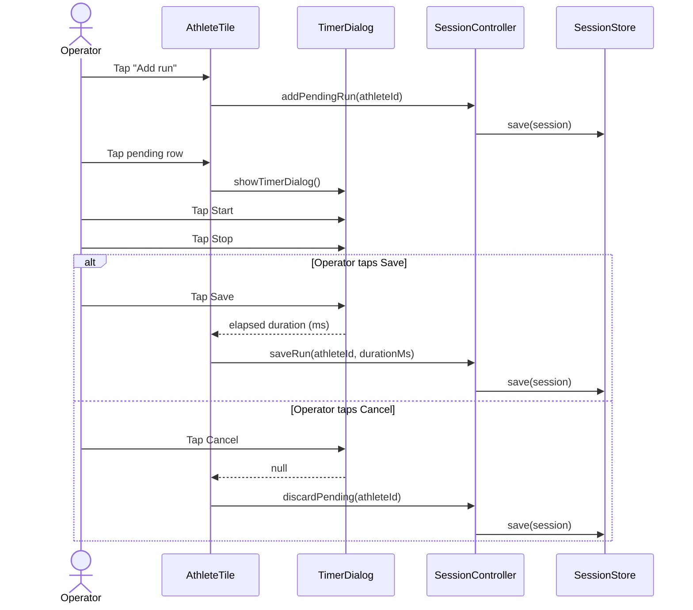
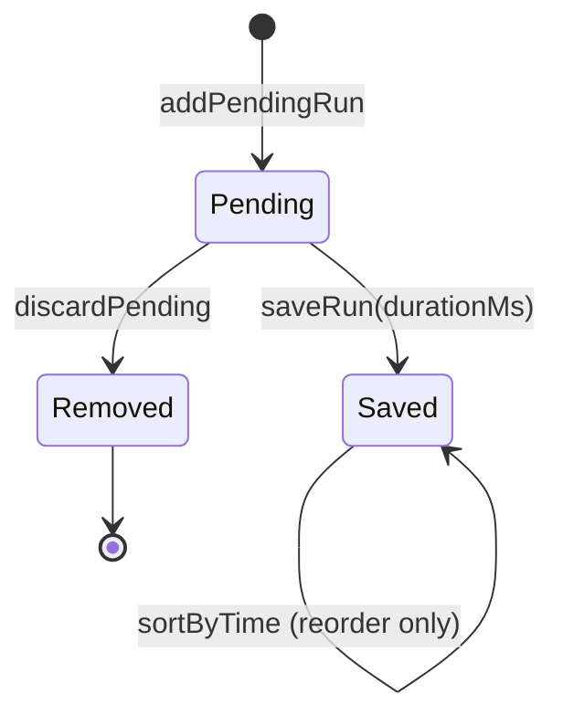

# Feature: Session Timer

<!-- toc -->

- [1. Feature Context](#1-feature-context)
  - [1.1 Overview](#11-overview)
  - [1.2 Purpose](#12-purpose)
  - [1.3 Actors](#13-actors)
  - [1.4 References](#14-references)
- [2. Actor Flows (CDSL)](#2-actor-flows-cdsl)
  - [Add Athlete](#add-athlete)
  - [Time and Save a Run](#time-and-save-a-run)
  - [Sort Runs by Time](#sort-runs-by-time)
  - [Export Session CSV](#export-session-csv)
  - [Start New Session](#start-new-session)
  - [Resume Session on Launch](#resume-session-on-launch)
- [3. Processes / Business Logic (CDSL)](#3-processes--business-logic-cdsl)
  - [Validate and Register Athlete](#validate-and-register-athlete)
  - [Add Pending Run (Run Numbering)](#add-pending-run-run-numbering)
  - [Sort Athlete Runs by Duration](#sort-athlete-runs-by-duration)
  - [Build CSV Export](#build-csv-export)
  - [Persist Session (Load / Save / Clear)](#persist-session-load--save--clear)
  - [Recover Pending Run on Load](#recover-pending-run-on-load)
- [4. States (CDSL)](#4-states-cdsl)
  - [Run Lifecycle State Machine](#run-lifecycle-state-machine)
  - [Timer Dialog Phase State Machine](#timer-dialog-phase-state-machine)
- [5. Definitions of Done](#5-definitions-of-done)
  - [Athlete Roster Cap and Color Assignment](#athlete-roster-cap-and-color-assignment)
  - [Single Pending Run Per Athlete](#single-pending-run-per-athlete)
  - [Centisecond Timer Capture](#centisecond-timer-capture)
  - [Session Persistence and Crash-Safe Restore](#session-persistence-and-crash-safe-restore)
  - [CSV Export of Saved Runs](#csv-export-of-saved-runs)
  - [New Session Save vs Cancel](#new-session-save-vs-cancel)
  - [Sort Runs by Time (DoD)](#sort-runs-by-time-dod)
- [6. Acceptance Criteria](#6-acceptance-criteria)
- [7. Traceability](#7-traceability)

<!-- /toc -->

- [ ] `p1` - **ID**: `cpt-climberapp-featstatus-session-timer`
## 1. Feature Context

### 1.1 Overview

Session Timer is the core multi-athlete session timing feature of Climber Speed Timer: a touch-friendly Flutter Web app that times climbers' attempts to the centisecond, keeps a per-athlete results table for a gym session with up to 10 athletes, persists the session in the browser between reloads, and exports all saved runs to CSV when a session ends. A peer measurement capability, Quick mode, is defined in the `climberapp-measurement-mode-entry` FEATURE.

### 1.2 Purpose

This feature exists to let a session operator run a speed-climbing timing session end-to-end in the browser: register up to 10 athletes, time each attempt to centisecond precision, keep a running results table per athlete, and hand off results as a CSV file at the end of the session — all without a backend, since the app is deployed as a static Flutter Web bundle on GitHub Pages (evidence: `lib/main.dart:1-32`, `README.md`, `PLAN.md`).

**Requirements**: No PRD exists yet for ClimberApp, so FR / NFR requirement IDs cannot be cited (gap — see Section 7 Traceability).

**Principles**: No DESIGN exists yet for ClimberApp, so principle IDs cannot be cited (gap — see Section 7 Traceability).

### 1.3 Actors

| Actor                                 | Role in Feature                                                                                                                                                                                                                                                               |
| ------------------------------------- | ----------------------------------------------------------------------------------------------------------------------------------------------------------------------------------------------------------------------------------------------------------------------------- |
| Timer operator | Adds athletes, times and saves/discards runs, sorts results, exports CSV, and starts or cancels new sessions. This is the single, undifferentiated operator role found in the UI — no authentication or role model exists in `lib/` (see Section 7 pattern-inference note 1). When a PRD is authored, a shared actor ID may be cited here. |

### 1.4 References

- **PRD**: Not yet authored for ClimberApp (gap — see Section 7 Traceability). This FEATURE was reverse-engineered directly from `lib/` and cross-checked against `PLAN.md` and `README.md`.
- **Design**: Not yet authored for ClimberApp (gap — see Section 7 Traceability).
- **Dependencies**: None upstream. Session Timer has no dependency on any other FEATURE artifact.
- **Used by**: `climberapp-measurement-mode-entry` FEATURE. That feature owns mode entry (ModePicker), Quick mode, and the lazy-load lifecycle for `climber_session_v1`. It supersedes the resume-on-launch load timing documented in this feature's `cpt-climberapp-flow-session-timer-resume-session` flow (hydration is deferred from app start to first Session entry). All in-mode Session behavior defined in this document — athlete roster, run timing, TimerDialog Save/Cancel, CSV export, and `climber_session_v1` persistence — remains the authoritative specification and is unchanged.

## 2. Actor Flows (CDSL)

User-facing interactions that start with the timer operator and describe the end-to-end flow of a use case.

**Use cases**: No PRD-level use-case catalog exists yet for ClimberApp (gap — see Section 7 Traceability); the flows below are derived directly from observed UI and controller behavior in `lib/`.

### Add Athlete

- [ ] `p1` - **ID**: `cpt-climberapp-flow-session-timer-add-athlete`

**Actor**: Timer operator

**Success Scenarios**:

- Operator adds an athlete with a valid name while the roster has fewer than 10 athletes; the athlete appears in the list with a color not used by any other current athlete.

**Error Scenarios**:

- Operator submits an empty or whitespace-only name; no athlete is added.
- Operator attempts to add an athlete while the roster already holds 10 athletes; the request is rejected and a capacity notice is shown.

**Steps**:

1. [ ] - `p1` - Operator taps "Add athlete" and enters a name in the dialog - `inst-add-athlete-enter-name`
2. [ ] - `p1` - Algorithm: validate and register athlete using `cpt-climberapp-algo-session-timer-validate-add-athlete` - `inst-add-athlete-run-validate`
3. [ ] - `p1` - **IF** the athlete was registered - `inst-add-athlete-if-registered`
  1. [ ] - `p1` - System appends the athlete to the roster and persists the session - `inst-add-athlete-persist`
  2. [ ] - `p1` - **RETURN** athlete visible in roster - `inst-add-athlete-return-ok`
4. [ ] - `p2` - **ELSE** - `inst-add-athlete-else`
  1. [ ] - `p2` - **IF** the roster already holds the maximum of 10 athletes - `inst-add-athlete-if-cap`
    1. [ ] - `p2` - System shows a "Maximum of 10 athletes reached." notice - `inst-add-athlete-cap-message`
  2. [ ] - `p2` - **RETURN** roster unchanged - `inst-add-athlete-return-unchanged`

### Time and Save a Run

- [ ] `p1` - **ID**: `cpt-climberapp-flow-session-timer-time-and-save-run`

**Actor**: Timer operator

**Success Scenarios**:

- Operator expands an athlete's tile, adds a pending run, records elapsed time via Start/Stop, and taps Save; the run is stored with duration and a completion timestamp.

**Error Scenarios**:

- Operator taps Cancel in the timer overlay (or dismisses it) after stopping; the pending run is discarded and nothing is recorded.
- Operator attempts to add a second pending run for the same athlete while one is already pending; the request is ignored.

**Steps**:

1. [ ] - `p1` - Operator expands an athlete tile and taps "Add run" - `inst-time-run-add-pending`
2. [ ] - `p1` - Algorithm: create pending run using `cpt-climberapp-algo-session-timer-add-pending-run` - `inst-time-run-run-add-pending-algo`
3. [ ] - `p1` - Operator taps the pending row to open the timer overlay - `inst-time-run-open-timer`
4. [ ] - `p1` - Operator taps "Start"; system begins timing and updates the on-screen display at a fixed interval - `inst-time-run-start`
5. [ ] - `p1` - Operator taps "Stop"; system freezes the elapsed display and reveals Save/Cancel controls - `inst-time-run-stop`
6. [ ] - `p1` - **IF** operator taps "Save" - `inst-time-run-if-save`
  1. [ ] - `p1` - System converts the pending run into a saved run with the captured duration and current timestamp, and persists the session - `inst-time-run-save-run`
  2. [ ] - `p2` - **IF** the athlete's run list is currently sorted by time - `inst-time-run-if-sorted`
    1. [ ] - `p2` - System re-sorts the athlete's saved runs ascending by duration - `inst-time-run-resort`
  3. [ ] - `p1` - **RETURN** run saved and visible in the runs table - `inst-time-run-return-saved`
7. [ ] - `p1` - **ELSE** (operator taps "Cancel" or dismisses the overlay) - `inst-time-run-else-cancel`
  1. [ ] - `p1` - System discards the pending run, leaving previously saved runs unchanged - `inst-time-run-discard`
  2. [ ] - `p1` - **RETURN** pending run removed - `inst-time-run-return-discarded`

*Diagram rationale*: this flow spans four collaborating units (`AthleteTile`, `TimerDialog`, `SessionController`, `SessionStore`) with a save/cancel branch, so a sequence diagram is warranted per the diagramming instructions; the other flows in this section are single-collaborator interactions and are adequately expressed as CDSL steps alone.

### Sort Runs by Time

- [ ] `p1` - **ID**: `cpt-climberapp-flow-session-timer-sort-runs-by-time`

**Actor**: Timer operator

**Success Scenarios**:

- Operator taps "Sort by time" once an athlete has 2 or more saved runs; the list reorders ascending by duration with any pending row kept last.

**Error Scenarios**:

- Operator has fewer than 2 saved runs for the athlete; the sort control stays disabled and no action is possible.

**Steps**:

1. [ ] - `p2` - **IF** the athlete has fewer than 2 saved runs - `inst-sort-if-below-threshold`
  1. [ ] - `p2` - System keeps "Sort by time" disabled - `inst-sort-disabled`
  2. [ ] - `p2` - **RETURN** no reordering available - `inst-sort-return-disabled`
2. [ ] - `p1` - **ELSE** (2 or more saved runs) - `inst-sort-else`
  1. [ ] - `p1` - Operator taps "Sort by time" - `inst-sort-tap`
  2. [ ] - `p1` - Algorithm: reorder runs using `cpt-climberapp-algo-session-timer-sort-athlete-runs` - `inst-sort-run-algo`
  3. [ ] - `p1` - System persists the session and marks the athlete's list as sorted - `inst-sort-persist`
  4. [ ] - `p1` - **RETURN** saved runs displayed ascending by duration with any pending row last - `inst-sort-return-sorted`

### Export Session CSV

- [ ] `p1` - **ID**: `cpt-climberapp-flow-session-timer-export-csv`

**Actor**: Timer operator

**Success Scenarios**:

- Operator taps the export icon with at least one athlete present; a CSV file downloads containing every saved run across all athletes.

**Error Scenarios**:

- Roster is empty; the export control stays disabled and no export is possible.

**Steps**:

1. [ ] - `p2` - **IF** the roster is empty - `inst-export-if-empty`
  1. [ ] - `p2` - System keeps the export control disabled - `inst-export-disabled`
  2. [ ] - `p2` - **RETURN** no export available - `inst-export-return-disabled`
2. [ ] - `p1` - **ELSE** (roster has at least one athlete) - `inst-export-else`
  1. [ ] - `p1` - Operator taps the export icon - `inst-export-tap`
  2. [ ] - `p1` - Algorithm: build CSV text using `cpt-climberapp-algo-session-timer-build-csv` - `inst-export-build-csv`
  3. [ ] - `p1` - System triggers a browser file download of the CSV and shows a "CSV downloaded." confirmation - `inst-export-download`
  4. [ ] - `p1` - **RETURN** CSV file downloaded - `inst-export-return-downloaded`

### Start New Session

- [ ] `p1` - **ID**: `cpt-climberapp-flow-session-timer-start-new-session`

**Actor**: Timer operator

**Success Scenarios**:

- Operator taps "New session", chooses Save; current results export as CSV, then the session clears.
- Operator taps "New session", chooses Cancel; the session clears without exporting.

**Error Scenarios**:

- Roster is empty; the "New session" control stays disabled and no action is possible.

**Steps**:

1. [ ] - `p2` - **IF** the roster is empty - `inst-newsession-if-empty`
  1. [ ] - `p2` - System keeps "New session" disabled - `inst-newsession-disabled`
  2. [ ] - `p2` - **RETURN** no action available - `inst-newsession-return-disabled`
2. [ ] - `p1` - **ELSE** (roster has at least one athlete) - `inst-newsession-else`
  1. [ ] - `p1` - Operator taps "New session"; the confirmation dialog opens - `inst-newsession-tap`
  2. [ ] - `p1` - **IF** operator chooses "Save" - `inst-newsession-if-save`
    1. [ ] - `p1` - Algorithm: build CSV text using `cpt-climberapp-algo-session-timer-build-csv` and trigger a download - `inst-newsession-export`
    2. [ ] - `p1` - Algorithm: clear session using `cpt-climberapp-algo-session-timer-persist-session` - `inst-newsession-clear-after-save`
    3. [ ] - `p1` - **RETURN** roster cleared after export - `inst-newsession-return-saved`
  3. [ ] - `p1` - **ELSE** (operator chooses "Cancel") - `inst-newsession-else-cancel`
    1. [ ] - `p1` - Algorithm: clear session using `cpt-climberapp-algo-session-timer-persist-session` without exporting - `inst-newsession-clear-only`
    2. [ ] - `p1` - **RETURN** roster cleared without export - `inst-newsession-return-cancelled`
  4. [ ] - `p2` - System collapses all expanded athlete tiles - `inst-newsession-collapse-tiles`

### Resume Session on Launch

- [ ] `p1` - **ID**: `cpt-climberapp-flow-session-timer-resume-session`

**Actor**: Timer operator

**Success Scenarios**:

- Operator reopens the app after a previous session; the roster and saved runs restore from local browser storage.

**Error Scenarios**:

- Previous session ended mid-timer (crash or unclean close) leaving a pending run in storage; the leftover pending run is dropped so the operator sees only completed runs.

**Steps**:

1. [ ] - `p1` - App starts and loads the persisted session before rendering the home screen - `inst-resume-load`
2. [ ] - `p1` - Algorithm: restore and sanitize session using `cpt-climberapp-algo-session-timer-recover-pending-on-load` - `inst-resume-sanitize`
3. [ ] - `p1` - **RETURN** roster and saved runs displayed on the home screen - `inst-resume-return`

**Timing qualification**: When deployed with `climberapp-measurement-mode-entry`, this load is triggered at first entry into Session mode (not at app start), via `cpt-climberapp-algo-measurement-mode-entry-lazy-load-session-store`. The sanitization step (`inst-resume-sanitize`) is unchanged; only the trigger point is superseded by that feature.

## 3. Processes / Business Logic (CDSL)

Internal functions called by the actor flows above; they do not interact with the operator directly.

### Validate and Register Athlete

- [ ] `p2` - **ID**: `cpt-climberapp-algo-session-timer-validate-add-athlete`

**Input**: proposed athlete name (raw text), current roster of athletes

**Output**: whether an athlete was registered, and — if so — the updated roster including the new athlete with an assigned color

**Steps**:

1. [ ] - `p1` - Trim leading/trailing whitespace from the proposed name - `inst-validate-athlete-trim`
2. [ ] - `p1` - **IF** the trimmed name is empty - `inst-validate-athlete-if-empty`
  1. [ ] - `p1` - **RETURN** not registered - `inst-validate-athlete-return-empty`
3. [ ] - `p1` - **IF** the roster already has 10 athletes - `inst-validate-athlete-if-cap`
  1. [ ] - `p1` - **RETURN** not registered - `inst-validate-athlete-return-cap`
4. [ ] - `p1` - Determine the lowest palette color index not already used by an existing athlete - `inst-validate-athlete-pick-color`
5. [ ] - `p1` - Create a new athlete record with a generated ID, the trimmed name, and the chosen color index - `inst-validate-athlete-create`
6. [ ] - `p1` - **RETURN** registered with updated roster - `inst-validate-athlete-return-ok`

### Add Pending Run (Run Numbering)

- [ ] `p2` - **ID**: `cpt-climberapp-algo-session-timer-add-pending-run`

**Input**: athlete ID, athlete's current runs

**Output**: whether a pending run was added, and — if so — the athlete's runs including the new pending row

**Steps**:

1. [ ] - `p1` - **IF** the athlete already has a pending run - `inst-add-pending-if-exists`
  1. [ ] - `p1` - **RETURN** not added - `inst-add-pending-return-exists`
2. [ ] - `p1` - Determine the next run number as one greater than the highest saved run number, or 1 if none exist - `inst-add-pending-next-number`
3. [ ] - `p1` - Create a new run record marked pending, with the next run number and no duration - `inst-add-pending-create`
4. [ ] - `p1` - Append the pending run to the athlete's runs and persist the session - `inst-add-pending-persist`
5. [ ] - `p1` - **RETURN** added - `inst-add-pending-return-ok`

### Sort Athlete Runs by Duration

- [ ] `p2` - **ID**: `cpt-climberapp-algo-session-timer-sort-athlete-runs`

**Input**: athlete's current runs

**Output**: athlete's runs reordered with saved runs ascending by duration, followed by any pending run

**Steps**:

1. [ ] - `p1` - Separate the athlete's runs into saved runs and pending run(s) - `inst-sort-runs-separate`
2. [ ] - `p1` - Sort the saved runs ascending by recorded duration - `inst-sort-runs-sort`
3. [ ] - `p1` - Concatenate the sorted saved runs followed by any pending run(s) - `inst-sort-runs-concat`
4. [ ] - `p1` - **RETURN** reordered runs - `inst-sort-runs-return`

### Build CSV Export

- [ ] `p2` - **ID**: `cpt-climberapp-algo-session-timer-build-csv`

**Input**: current session (all athletes and their runs)

**Output**: CSV text with a header row and one data row per saved run

**Steps**:

1. [ ] - `p1` - Write the header row "athlete,run,time,date,timestamp" - `inst-build-csv-header`
2. [ ] - `p1` - **FOR EACH** athlete in the session - `inst-build-csv-for-athlete`
  1. [ ] - `p1` - **FOR EACH** run belonging to the athlete - `inst-build-csv-for-run`
    1. [ ] - `p1` - **IF** the run is pending or has no recorded duration - `inst-build-csv-if-skip`
      1. [ ] - `p1` - Skip the run - `inst-build-csv-skip`
    2. [ ] - `p1` - **ELSE** - `inst-build-csv-else`
      1. [ ] - `p1` - Escape the athlete name if it contains a comma, quote, or newline - `inst-build-csv-escape`
      2. [ ] - `p1` - Append a row with athlete name, run number, formatted duration, completion date, and completion time - `inst-build-csv-append-row`
3. [ ] - `p1` - **RETURN** CSV text - `inst-build-csv-return`

### Persist Session (Load / Save / Clear)

- [ ] `p2` - **ID**: `cpt-climberapp-algo-session-timer-persist-session`

**Input**: session state to save/clear, or a previously stored session record to load

**Output**: loaded session (on load), or confirmation of durable storage (on save/clear)

**Steps**:

1. [ ] - `p1` - **TRY** reading the stored session record from local browser storage - `inst-persist-try-read`
2. [ ] - `p1` - **IF** no record exists or it fails to parse - `inst-persist-if-missing-or-corrupt`
  1. [ ] - `p1` - **RETURN** an empty session - `inst-persist-return-empty`
3. [ ] - `p1` - **ELSE** - `inst-persist-else`
  1. [ ] - `p1` - **RETURN** the decoded session - `inst-persist-return-decoded`
4. [ ] - `p1` - On save: encode the current session and write it to local browser storage under a fixed key - `inst-persist-save`
5. [ ] - `p1` - On clear: remove the stored session record from local browser storage - `inst-persist-clear`

**Load/parse-failure UX**: When the stored record is absent, empty, or fails to parse (non-`Map` JSON or any decode exception), `SessionStore.load()` silently returns `Session.empty()` (evidence: `lib/services/session_store.dart:20-31`). The operator sees an empty athlete roster with no error dialog or notification. This is intentional silent-recovery behavior consistent with the existing implementation; adding a user-visible parse-error notification is deferred and represents an acceptance gap.

### Recover Pending Run on Load

- [ ] `p2` - **ID**: `cpt-climberapp-algo-session-timer-recover-pending-on-load`

**Input**: session loaded from storage

**Output**: sanitized session containing no pending runs

**Steps**:

1. [ ] - `p1` - Load the persisted session using `cpt-climberapp-algo-session-timer-persist-session` - `inst-recover-load`
2. [ ] - `p1` - **FOR EACH** athlete in the loaded session - `inst-recover-for-athlete`
  1. [ ] - `p1` - Remove any run marked pending from the athlete's runs - `inst-recover-strip-pending`
3. [ ] - `p1` - **RETURN** sanitized session ready for display - `inst-recover-return`

## 4. States (CDSL)

### Run Lifecycle State Machine

- [ ] `p2` - **ID**: `cpt-climberapp-state-session-timer-run-lifecycle`

**States**: Pending, Saved, Removed

**Initial State**: Pending (a `Run` record only comes into existence already marked pending; there is no separate "not created" state modeled in the entity)

**Transitions**:

1. [ ] - `p1` - **FROM** Pending **TO** Saved **WHEN** operator saves the timer overlay with an elapsed duration - `inst-run-state-pending-to-saved`
2. [ ] - `p1` - **FROM** Pending **TO** Removed **WHEN** operator cancels/dismisses the timer overlay or otherwise discards the pending run - `inst-run-state-pending-to-removed`
3. [ ] - `p2` - **FROM** Saved **TO** Saved **WHEN** operator triggers Sort by Time (duration and completion data are unchanged; only list position may change) - `inst-run-state-saved-resort`

### Timer Dialog Phase State Machine

- [ ] `p2` - **ID**: `cpt-climberapp-state-session-timer-timer-phase`

**States**: Idle, Running, Stopped

**Initial State**: Idle

**Transitions**:

1. [ ] - `p1` - **FROM** Idle **TO** Running **WHEN** operator taps Start - `inst-timer-phase-idle-to-running`
2. [ ] - `p1` - **FROM** Running **TO** Stopped **WHEN** operator taps Stop - `inst-timer-phase-running-to-stopped`
3. [ ] - `p1` - **FROM** Stopped **TO** (overlay closed, phase discarded) **WHEN** operator taps Save or Cancel - `inst-timer-phase-stopped-to-closed`

This phase state is ephemeral and not persisted: it exists only for the lifetime of one open timer overlay and resets to Idle each time the overlay reopens (evidence: `lib/widgets/timer_dialog.dart:14-27`).

## 5. Definitions of Done

### Athlete Roster Cap and Color Assignment

- [ ] `p1` - **ID**: `cpt-climberapp-dod-session-timer-athlete-cap-and-color`

The system **MUST** cap the roster at 10 athletes and assign each newly added athlete the lowest-indexed color from the fixed 10-color palette that is not already in use by another current athlete.

**Implements**:

- `cpt-climberapp-flow-session-timer-add-athlete`
- `cpt-climberapp-algo-session-timer-validate-add-athlete`

**Constraints**: None cited — no DESIGN constraints catalog exists yet for ClimberApp (gap, see Section 7 Traceability).

**Touches**:

- API: None (no backend; the app makes no network calls)
- DB: None (browser-local storage only, not a relational table)
- Entities: `Athlete`

### Single Pending Run Per Athlete

- [ ] `p1` - **ID**: `cpt-climberapp-dod-session-timer-single-pending-run`

The system **MUST** allow at most one pending (unsaved) run per athlete at a time, rejecting additional pending-run requests until the existing pending run is saved or discarded.

**Implements**:

- `cpt-climberapp-flow-session-timer-time-and-save-run`
- `cpt-climberapp-algo-session-timer-add-pending-run`

**Constraints**: None cited (gap, see Section 7 Traceability).

**Touches**:

- API: None
- DB: None
- Entities: `Run`

### Centisecond Timer Capture

- [ ] `p1` - **ID**: `cpt-climberapp-dod-session-timer-centisecond-timer-capture`

The system **MUST** display elapsed time with centisecond precision (`MM:SS.cc`) from Start to Stop and use the frozen elapsed value as the saved run's duration.

**Implements**:

- `cpt-climberapp-flow-session-timer-time-and-save-run`

**Constraints**: None cited (gap, see Section 7 Traceability).

**Touches**:

- API: None
- DB: None
- Entities: `Run`

### Session Persistence and Crash-Safe Restore

- [ ] `p1` - **ID**: `cpt-climberapp-dod-session-timer-persistence-and-restore`

The system **MUST** persist the roster and all runs to local browser storage after every mutating action, and **MUST** discard any leftover pending run when the Session store is loaded. Historically this occurred at app launch; when deployed with `climberapp-measurement-mode-entry`, the load (and therefore the sanitization) is superseded to first Session entry. The sanitization behavior itself is unchanged regardless of trigger timing.

**Implements**:

- `cpt-climberapp-flow-session-timer-resume-session`
- `cpt-climberapp-algo-session-timer-persist-session`
- `cpt-climberapp-algo-session-timer-recover-pending-on-load`

**Constraints**: None cited (gap, see Section 7 Traceability).

**Touches**:

- API: None
- DB: Browser local storage under key `climber_session_v1` (not a relational table)
- Entities: `Session`, `Athlete`, `Run`

### CSV Export of Saved Runs

- [ ] `p1` - **ID**: `cpt-climberapp-dod-session-timer-csv-export`

The system **MUST** export a CSV file (columns: athlete, run, time, date, timestamp) covering every saved run for every athlete in the session, excluding any pending run, and **MUST** trigger a browser file download of that CSV.

**Implements**:

- `cpt-climberapp-flow-session-timer-export-csv`
- `cpt-climberapp-algo-session-timer-build-csv`

**Constraints**: None cited (gap, see Section 7 Traceability).

**Touches**:

- API: None
- DB: None
- Entities: `Session`, `Athlete`, `Run`

### New Session Save vs Cancel

- [ ] `p1` - **ID**: `cpt-climberapp-dod-session-timer-new-session-save-cancel`

The system **MUST** offer a New Session action that either exports the current results as CSV before clearing the session (Save) or clears the session without exporting (Cancel), and **MUST** disable the action while the roster is empty.

**Implements**:

- `cpt-climberapp-flow-session-timer-start-new-session`
- `cpt-climberapp-algo-session-timer-build-csv`
- `cpt-climberapp-algo-session-timer-persist-session`

**Constraints**: None cited (gap, see Section 7 Traceability).

**Touches**:

- API: None
- DB: None
- Entities: `Session`

### Sort Runs by Time (DoD)

- [ ] `p1` - **ID**: `cpt-climberapp-dod-session-timer-sort-by-time`

The system **MUST** let the operator reorder an athlete's saved runs ascending by duration once at least 2 saved runs exist, keeping any pending run after the sorted saved runs.

**Implements**:

- `cpt-climberapp-flow-session-timer-sort-runs-by-time`
- `cpt-climberapp-algo-session-timer-sort-athlete-runs`

**Constraints**: None cited (gap, see Section 7 Traceability).

**Touches**:

- API: None
- DB: None
- Entities: `Run`

## 6. Acceptance Criteria

- [ ] Adding up to 10 athletes succeeds, each with a distinct palette color index (`test/state/controller_athletes_test.dart`)
- [ ] Adding an 11th athlete is rejected and the roster stays at 10 (`test/state/controller_athletes_test.dart`)
- [ ] Clearing the session empties the athlete roster (`test/state/controller_athletes_test.dart`)
- [ ] Adding a pending run creates exactly one pending row; a second add request while pending is a no-op (`test/state/controller_runs_test.dart`, `test/ui_flows_test.dart`)
- [ ] Saving a run converts the pending row into a saved run with duration, completion timestamp, and correct run number, and clears the pending flag (`test/state/controller_runs_test.dart`)
- [ ] Discarding a pending run removes it while leaving previously saved runs unchanged (`test/state/controller_runs_test.dart`, `test/ui_flows_test.dart`)
- [ ] Sorting by time orders an athlete's saved runs ascending by duration (`test/state/controller_runs_test.dart`, `test/ui_flows_test.dart`)
- [ ] CSV export includes every saved run for every athlete with columns athlete/run/time/date/timestamp, and excludes pending runs (`test/services/csv_export_test.dart`)
- [ ] Reloading the app after persistence restores athletes and their saved runs, including duration and completion timestamp (`test/ui_flows_test.dart`)
- [ ] New Session → Cancel clears the roster without requiring an export (`test/ui_flows_test.dart`)
- [ ] The Add Athlete floating action button is disabled once the roster reaches 10 athletes (`test/ui_flows_test.dart`)
- [ ] The timer overlay shows enlarged Start/Stop controls while idle/running and reveals Save/Cancel only after Stop (`test/ui_flows_test.dart`)

## 7. Traceability

**source_markers**: `[]` — a repository-wide search for `@cpt-` under `lib/` returned zero matches. No code markers exist to trace any ID in this document to an implementation location.

**gap_flags**:

1. `severity: warning`, `kind: FEATURE` — No `@cpt-*` markers found under `lib/`; marker count is below the minimum expected for a traceable FEATURE (source: frozen input payload `gap_flags[0]`).
2. `severity: high` — No PRD exists for ClimberApp: the actor catalog (Section 1.3), functional/non-functional requirement references (Section 1.2), and use-case catalog (Section 2 preamble) are not sourced from a PRD; they were inferred entirely from `lib/`, `test/`, `README.md`, and `PLAN.md`.
3. `severity: high` — No DESIGN exists for ClimberApp: design principles, constraints, and component IDs referenced in Section 5 (`Constraints` fields) could not be cited from a canonical DESIGN document.
4. `severity: medium` — No DECOMPOSITION/parent feature manifest exists: this FEATURE was authored standalone (mode=create, reverse-engineer layout under `docs/sdlc/FEATURE/`) rather than derived from a DECOMPOSITION entry.
5. `severity: medium` — All checklist boxes in this document (the H1 featstatus rollup, every ID definition, and every CDSL step) are intentionally left unchecked (`[ ]`) because no `@cpt-*` code markers exist anywhere in `lib/` to satisfy the checked-ref-implies-checked-def and `to_code` traceability rules in the FEATURE rules (`FeatureValidate` unit). The underlying behavior is nonetheless exercised by the existing automated test suite, cited per Acceptance Criteria and Definitions of Done above.
6. `severity: info` — No `feature`-kind parent ID: FEATURE deterministic constraints prohibit authoring a `feature`-kind CDSL ID in this artifact. The top-level rollup ID `cpt-climberapp-featstatus-session-timer` is the valid and complete featstatus parent under current FEATURE rules. No separate `feature`-kind ID is authored, required, or expected.

**methodology_reference**: `.cf-studio/.core/requirements/reverse-engineering.md` (Reverse Engineering Methodology v1.0). The frozen `marker_map` was empty, so per `ReverseEngineeringActivation`/`ReverseEngineeringLayerOrder`, all flows, processes, states, and Definitions of Done in this document were derived via pattern inference (L2 Entry Point Analysis, L3 Structural Decomposition, L4 Data Flow Tracing, L6 State Management Analysis) rather than marker extraction, per `methodology: "reverse-engineering marker-first; pattern-inference only to fill flagged gaps; never invent unsupported product facts"` in the frozen input payload.

**pattern_inference_notes**:

1. Single undifferentiated operator actor (no role/auth model found) — evidence: `lib/screens/home_screen.dart:20-146` (add athlete, export, and new-session actions are all exposed to one UI role; no authentication or authorization code exists anywhere in `lib/`).
2. Add Athlete cap/color-assignment behavior — evidence: `lib/state/session_controller.dart:61-86`.
3. Time and Save a Run flow (add pending / start / stop / save / discard) — evidence: `lib/widgets/athlete_tile.dart:57-67`, `lib/widgets/timer_dialog.dart:29-62`, `lib/state/session_controller.dart:109-171`.
4. Sort Runs by Time enable-at-2-saved-runs threshold — evidence: `lib/widgets/runs_table.dart:33-39`, `lib/state/session_controller.dart:174-197`.
5. Export Session CSV flow and empty-roster disabled control — evidence: `lib/screens/home_screen.dart:81-92`, `lib/state/session_controller.dart:208-214`, `lib/services/csv_export.dart:6-23`, `lib/services/csv_download_web.dart:1-13`, `lib/services/csv_download_stub.dart:1-2`.
6. Start New Session Save-vs-Cancel branching — evidence: `lib/widgets/new_session_dialog.dart:1-33`, `lib/state/session_controller.dart:216-225`.
7. Resume Session on Launch and crash-recovery pending-run cleanup — evidence: `lib/main.dart:5-9`, `lib/state/session_controller.dart:40-54`.
8. Run lifecycle states (Pending / Saved / Removed) — evidence: `lib/models/run.dart:1-33`, `lib/state/session_controller.dart:120-171`.
9. Timer dialog phase states (Idle / Running / Stopped) — evidence: `lib/widgets/timer_dialog.dart:14-62`.
10. Centisecond display precision (`MM:SS.cc`) — evidence: `lib/models/time_format.dart:1-12`.
11. Persistence key and corrupt-data fallback behavior — evidence: `lib/services/session_store.dart:9,17-32`.
12. All Acceptance Criteria mapped one-to-one to existing automated tests — evidence: `test/state/controller_athletes_test.dart`, `test/state/controller_runs_test.dart`, `test/services/csv_export_test.dart`, `test/ui_flows_test.dart`.

**Domain Applicability** (per FEATURE checklist Review Scope Selection — feature type: User-facing UI):

- **ARCH, UX, TEST**: Addressed above in Sections 2–6.
- **SEC**: Not applicable — the app is a single-user, client-only Flutter Web bundle with no accounts, no authentication/authorization code, and no network calls anywhere in `lib/`; the only user-entered data is an athlete's display name.
- **PERF**: Addressed minimally — the only latency-sensitive path is the timer's 30ms UI tick (`lib/widgets/timer_dialog.dart:38`); all other operations are in-memory list operations bounded by at most 10 athletes.
- **REL**: Addressed via the Session Persistence and Crash-Safe Restore DoD; no other fault-tolerance surface exists since there are no network calls or external services.
- **DATA**: Addressed via the Persistence and CSV Export DoDs; no relational schema exists (`SharedPreferences` key-value storage only).
- **INT**: Not applicable — no external API, queue, or event integration exists anywhere in `lib/`.
- **OPS**: Not applicable — no logging/metrics/tracing infrastructure, feature flags, or runtime configuration exists in `lib/`; deployment is a static GitHub Pages build (per `AGENTS.md`) with no runtime configuration surface.
- **COMPL**: Not applicable — no regulated data categories (health, payment, government ID) are collected; only operator-entered athlete display names and locally-stored timing data are handled.
- **MAINT**: Addressed minimally — Session Timer's core data structures (`Athlete`, `Run`, `Session`) and service layer (`SessionStore`, `SessionController`) follow the existing `ChangeNotifier`/`SharedPreferences` pattern in `lib/state/` and `lib/services/`. No additional maintainability concerns are introduced. When deployed with `climberapp-measurement-mode-entry`, the shared timer engine extraction reduces duplication between `TimerDialog` and `QuickMeasureScreen`, improving maintainability of the timing logic owned by this feature.
- **A11Y (Accessibility)**: Addressed with bounded scope — Session Timer controls (Add Athlete, Add run, Sort by time, Export CSV, New session) MUST be implemented using semantic Flutter widget types (e.g. `ElevatedButton`, `TextButton`, `InkWell` with `Semantics`) so that screen readers can identify interactive controls; all tappable targets MUST meet Flutter's minimum recommended touch-target size (48 × 48 dp). Full WCAG 2.1 AA conformance audit is deferred; no dedicated accessibility testing infrastructure exists yet for ClimberApp (gap — see Section 7 Traceability).

