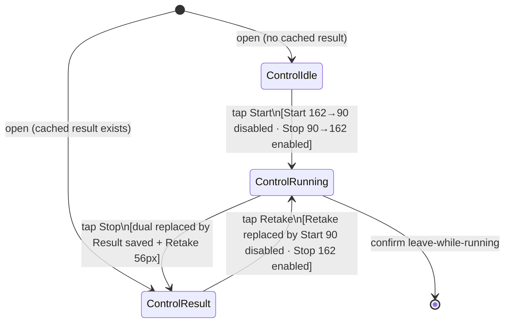

# Feature: Start-Stop Layout Design

<!-- toc -->

- [1. Feature Context](#1-feature-context)
  - [1.1 Overview](#11-overview)
  - [1.2 Purpose](#12-purpose)
  - [1.3 Actors](#13-actors)
  - [1.4 References](#14-references)
- [2. Actor Flows (CDSL)](#2-actor-flows-cdsl)
  - [Quick Start → Stop → Result (Control Layout)](#quick-start--stop--result-control-layout)
- [3. Processes / Business Logic (CDSL)](#3-processes--business-logic-cdsl)
  - [Resolve Control Presentation (Heights, Gaps, Button Types)](#resolve-control-presentation-heights-gaps-button-types)
- [4. States (CDSL)](#4-states-cdsl)
  - [Quick Control Presentation State Machine](#quick-control-presentation-state-machine)
- [5. Definitions of Done](#5-definitions-of-done)
  - [Dual Start/Stop Always Visible in Idle and Running](#dual-startstop-always-visible-in-idle-and-running)
  - [Button Heights Transfer to Full-Screen Quick](#button-heights-transfer-to-full-screen-quick)
  - [Top-Grouped Control Column (No Spacer)](#top-grouped-control-column-no-spacer)
  - [Button Label Font Size 21](#button-label-font-size-21)
  - [Button Types](#button-types)
  - [Clock Typography](#clock-typography)
  - [Result Phase Layout](#result-phase-layout)
  - [AppBar Title and Leave Guard (Preserved)](#appbar-title-and-leave-guard-preserved)
- [6. Acceptance Criteria](#6-acceptance-criteria)
- [7. Traceability](#7-traceability)

<!-- /toc -->

- [ ] `p1` - **ID**: `cpt-climberapp-featstatus-start-stop-layout-design`

## 1. Feature Context

### 1.1 Overview

Start-Stop Layout Design aligns the visual control column of `QuickMeasureScreen` with the `TimerDialog` pattern used in Session mode: dual Start/Stop buttons are always rendered in Idle and Running phases with a 162/90px active-inactive height swap, top-grouped directly under the AppBar clock without a `Spacer`. The Result phase replaces the dual buttons with a centered "Result saved" label and a 56px Retake button. No behavioral changes are made to Quick mode's auto-persist-on-stop model; only the presentation is redesigned.

### 1.2 Purpose

The current `QuickMeasureScreen` layout diverges from `TimerDialog` at five points: (1) single default-height button instead of dual always-visible Start/Stop; (2) `Spacer`-to-bottom instead of top-grouped column; (3) no height swap (162/90) on the active control; (4) no `tabularFigures` or `w600` on the clock; (5) no `fontSize: 21` on button labels. This FEATURE closes the divergence by transferring the `TimerDialog` height contract (162/90/56px), button types (`FilledButton`/`FilledButton.tonal`), label typography (fontSize 21), clock typography (`displayMedium` + tabularFigures + w600), gap rhythm (24px under clock, 12px between controls), and column structure (top-grouped, no `Spacer`) to the full-screen Quick surface.

**Requirements**: No PRD exists yet for ClimberApp, so FR / NFR requirement IDs cannot be cited (gap — see Section 7 Traceability).

**Principles**: No DESIGN exists yet for ClimberApp, so principle IDs cannot be cited (gap — see Section 7 Traceability).

### 1.3 Actors

| Actor | Role in Feature |
|-------|-----------------|
| Timer operator | Uses `QuickMeasureScreen` to time and capture a single result; experiences the redesigned dual-button control column, updated typography, and top-grouped layout. This is the single undifferentiated operator role across ClimberApp; no authentication or role model exists. When a PRD is authored, a shared actor ID may be cited here. |

### 1.4 References

- **PRD**: Not yet authored for ClimberApp (gap — see Section 7 Traceability). This FEATURE was authored from locked brainstorm decisions in `.cf-studio/.cache/brainstorm/start-stop-layout-design-2026-08-12T044600Z/design-decisions.md`.
- **Design**: Not yet authored for ClimberApp (gap — see Section 7 Traceability).
- **Layout template**: `lib/widgets/timer_dialog.dart:99-187` — `TimerDialog` is the control column source pattern being transferred to Quick. The `TimerDialog` is owned by `climberapp-session-timer`; see actor flow `cpt-climberapp-flow-session-timer-time-and-save-run` and timer phase SM `cpt-climberapp-state-session-timer-timer-phase`.
- **Dependencies**:
  - **Depends on** `climberapp-measurement-mode-entry` FEATURE for: Quick phase SM (`cpt-climberapp-state-measurement-mode-entry-quick-phase`), auto-persist-on-stop (`cpt-climberapp-dod-measurement-mode-entry-persist-on-stop`), retake-overwrites (`cpt-climberapp-dod-measurement-mode-entry-retake`), AppBar + leave guard (`cpt-climberapp-dod-measurement-mode-entry-back-nav`, `cpt-climberapp-dod-measurement-mode-entry-confirm-leave-running`), and full-screen surface (`cpt-climberapp-dod-measurement-mode-entry-quick-full-screen`). This FEATURE does not redefine those behaviors; it specifies only how controls are sized, typed, and arranged.
  - **Depends on** `climberapp-session-timer` FEATURE for the `TimerDialog` control column as the layout template.
- **Used by**: `climberapp-measurement-mode-entry` — control-column parity specifics for `QuickMeasureScreen` are now owned here; `cpt-climberapp-dod-measurement-mode-entry-quick-full-screen` in that FEATURE defers detailed layout DoDs to this document.

## 2. Actor Flows (CDSL)

User-facing interactions that start with the timer operator. The Quick phase lifecycle (Idle → Running → Result, auto-persist on stop, Retake, leave-while-running) is fully defined in `climberapp-measurement-mode-entry` (`cpt-climberapp-flow-measurement-mode-entry-quick-start-stop-result`, `cpt-climberapp-flow-measurement-mode-entry-quick-retake`, `cpt-climberapp-flow-measurement-mode-entry-leave-while-running`). The flow below is scoped to what the operator sees and interacts with at each phase from a control-layout perspective.

**Use cases**: No PRD-level use-case catalog exists yet for ClimberApp (gap — see Section 7 Traceability); the flow below is derived from locked brainstorm decisions.

### Quick Start → Stop → Result (Control Layout)

- [ ] `p1` - **ID**: `cpt-climberapp-flow-start-stop-layout-design-quick-control-layout`

**Actor**: Timer operator

**Success Scenarios**:

- Operator uses `QuickMeasureScreen` through Idle, Running, and Result phases; at each transition the control column presents the correct heights, button types, label sizes, and gap rhythm in a top-grouped column under the clock.

**Error Scenarios**:

- Operator taps the AppBar Back arrow or system back while Running; the leave-while-running confirmation dialog (governed by `cpt-climberapp-dod-measurement-mode-entry-confirm-leave-running`) is shown; if the operator confirms Leave, the screen closes without entering Result phase and the control layout is discarded.

**Steps**:

1. [ ] - `p1` - Operator opens `QuickMeasureScreen` with no cached result; the clock displays `00:00.00` centered (`displayMedium` + tabularFigures + w600); 24px below the clock, Start (`FilledButton`, 162px tall, fontSize 21, enabled) appears; 12px below Start, Stop (`FilledButton.tonal`, 90px tall, fontSize 21, disabled) appears; no `Spacer` separates the column from the bottom of the screen - `inst-layout-open-idle`
2. [ ] - `p1` - Operator taps Start; the clock begins incrementing; Start collapses to 90px (disabled) and Stop expands to 162px (enabled); the 24px and 12px gap positions are unchanged - `inst-layout-tap-start`
3. [ ] - `p1` - Operator taps Stop; the clock freezes at the captured duration; the Start/Stop pair is replaced by: "Result saved" text centered directly below the clock, a 24px gap, and Retake (`FilledButton`, 56px tall, fontSize 21, enabled); no Cancel button is shown (auto-persist semantics owned by `cpt-climberapp-dod-measurement-mode-entry-persist-on-stop`) - `inst-layout-tap-stop`
4. [ ] - `p1` - **RETURN** operator sees the result layout; may tap Retake to return to Running (per `cpt-climberapp-flow-measurement-mode-entry-quick-retake`) or navigate back via the AppBar - `inst-layout-return-result`

## 3. Processes / Business Logic (CDSL)

### Resolve Control Presentation (Heights, Gaps, Button Types)

- [ ] `p1` - **ID**: `cpt-climberapp-algo-start-stop-layout-design-resolve-control-presentation`

**Input**: current Quick phase (`Idle`, `Running`, or `Result`), operator interactions (tap Start, tap Stop, tap Retake, tap AppBar Back)

**Output**: control column widget tree with correct heights (162/90/56px), gaps (24/12px), button types (`FilledButton` / `FilledButton.tonal`), and label font sizes (21px); clock with typography (displayMedium + tabularFigures + w600)

**Steps**:

1. [ ] - `p1` - **ON** phase entry (Idle, Running, or Result), resolve the control presentation state - `inst-ctrl-resolve-on-phase`
2. [ ] - `p1` - **IF** phase is `Idle` - `inst-ctrl-if-idle`
   1. [ ] - `p1` - Render Start button: `FilledButton`, height 162px, enabled, label fontSize 21 - `inst-ctrl-idle-start-render`
   2. [ ] - `p1` - Render Stop button: `FilledButton.tonal`, height 90px, disabled, label fontSize 21 - `inst-ctrl-idle-stop-render`
   3. [ ] - `p1` - Insert 24px gap between clock and Start; insert 12px gap between Start and Stop - `inst-ctrl-idle-gaps`
3. [ ] - `p1` - **ELSE IF** phase is `Running` - `inst-ctrl-else-if-running`
   1. [ ] - `p1` - Render Start button: `FilledButton`, height 90px, disabled, label fontSize 21 - `inst-ctrl-running-start-render`
   2. [ ] - `p1` - Render Stop button: `FilledButton.tonal`, height 162px, enabled, label fontSize 21 - `inst-ctrl-running-stop-render`
   3. [ ] - `p1` - Insert 24px gap between clock and Start; insert 12px gap between Start and Stop - `inst-ctrl-running-gaps`
4. [ ] - `p1` - **ELSE IF** phase is `Result` - `inst-ctrl-else-if-result`
   1. [ ] - `p1` - Replace Start/Stop pair with "Result saved" label centered directly below clock - `inst-ctrl-result-label`
   2. [ ] - `p1` - Render Retake button: `FilledButton`, height 56px, enabled, label fontSize 21 - `inst-ctrl-result-retake-render`
   3. [ ] - `p1` - Insert 24px gap between "Result saved" label and Retake button - `inst-ctrl-result-gap`
5. [ ] - `p1` - Render clock with `displayMedium` style, `tabularFigures` font feature, `fontWeight: w600`, and `textAlign: center` - `inst-ctrl-clock-typography`
6. [ ] - `p1` - Arrange all controls (clock + gaps + buttons/label) in a top-grouped `Column` with no `Spacer` between the column and the bottom of the viewport - `inst-ctrl-top-grouped-column`
7. [ ] - `p1` - **RETURN** the control presentation widget tree to the enclosing `QuickMeasureScreen` layout - `inst-ctrl-return-widget-tree`

**Persistence and timer engine**: `cpt-climberapp-algo-measurement-mode-entry-persist-quick-result`, `cpt-climberapp-algo-measurement-mode-entry-timer-engine`, and `cpt-climberapp-algo-measurement-mode-entry-load-quick-store` are defined in `climberapp-measurement-mode-entry` and are unchanged by this layout redesign. This presentation-logic algorithm does not interact with those subsystems; it receives phase transitions as input and emits only widget layout output.

## 4. States (CDSL)

### Quick Control Presentation State Machine

- [ ] `p2` - **ID**: `cpt-climberapp-state-start-stop-layout-design-quick-control-pres`

This state machine describes the visual control presentation of `QuickMeasureScreen` at each phase. Phase transitions are owned by `cpt-climberapp-state-measurement-mode-entry-quick-phase`; this machine specifies only the corresponding layout contract.

**States**: `ControlIdle`, `ControlRunning`, `ControlResult`

**Initial State**: `ControlIdle` (or `ControlResult` when a cached `QuickResult` exists in `climber_quick_v1` on open, per `cpt-climberapp-state-measurement-mode-entry-quick-phase`)

**Transitions**:

1. [ ] - `p1` - **FROM** `ControlIdle` **TO** `ControlRunning` **WHEN** operator taps Start — Start height changes from 162px (enabled) to 90px (disabled); Stop height changes from 90px (disabled) to 162px (enabled); gap contract unchanged - `inst-ctrl-idle-to-running`
2. [ ] - `p1` - **FROM** `ControlRunning` **TO** `ControlResult` **WHEN** operator taps Stop — Start/Stop column replaced by "Result saved" label (centered, directly under clock) + 24px gap + Retake (`FilledButton`, 56px, enabled); result persisted automatically per `cpt-climberapp-dod-measurement-mode-entry-persist-on-stop` - `inst-ctrl-running-to-result`
3. [ ] - `p1` - **FROM** `ControlResult` **TO** `ControlRunning` **WHEN** operator taps Retake — result column replaced by Start (90px, disabled) / Stop (162px, enabled) dual layout; gap contract is reinstated - `inst-ctrl-result-to-running`
4. [ ] - `p1` - **FROM** `ControlRunning` **TO** (screen closed) **WHEN** operator confirms leave-while-running (per `cpt-climberapp-dod-measurement-mode-entry-confirm-leave-running`) — timer halted, screen popped to ModePicker, layout state discarded - `inst-ctrl-running-to-closed`

*Diagram rationale*: the three layout states each present a distinct control arrangement with different heights, types, and visibility rules; a state diagram with per-transition annotations captures the height-swap contract concisely for implementers.

## 5. Definitions of Done

### Dual Start/Stop Always Visible in Idle and Running

- [ ] `p1` - **ID**: `cpt-climberapp-dod-start-stop-layout-design-dual-buttons`

The system **MUST** render both the Start button and the Stop button simultaneously in `QuickMeasureScreen` during Idle and Running phases. In Idle, Start is enabled (height 162px) and Stop is disabled (height 90px). In Running, Stop is enabled (height 162px) and Start is disabled (height 90px). Neither button is hidden, conditionally removed from the widget tree, or replaced by the other for any reason while the phase is Idle or Running.

**Implements**:

- `cpt-climberapp-flow-start-stop-layout-design-quick-control-layout`
- `cpt-climberapp-state-start-stop-layout-design-quick-control-pres`

**Constraints**: None cited (gap — see Section 7 Traceability).

**Touches**:

- UI: `lib/screens/quick_measure_screen.dart` — replace the current phase-conditional single-button rendering with unconditional dual height-boxed buttons with heights driven by the current phase, mirroring `lib/widgets/timer_dialog.dart:127-154`

### Button Heights Transfer to Full-Screen Quick

- [ ] `p1` - **ID**: `cpt-climberapp-dod-start-stop-layout-design-height-contract`

The system **MUST** apply the `TimerDialog` height contract to `QuickMeasureScreen`: active control height **162px**, inactive control height **90px**, Retake height **56px**. Heights are phase-driven: Idle → Start=162px, Stop=90px; Running → Stop=162px, Start=90px; Result → Retake=56px. These values **MUST** match the `TimerDialog` constants exactly (evidence: `lib/widgets/timer_dialog.dart:128-154`).

**Implements**:

- `cpt-climberapp-flow-start-stop-layout-design-quick-control-layout`
- `cpt-climberapp-state-start-stop-layout-design-quick-control-pres`

**Constraints**: None cited (gap — see Section 7 Traceability).

**Touches**:

- UI: `lib/screens/quick_measure_screen.dart` — apply height values of 162/90/56px per phase; derive active-button flags from the current phase, mirroring `lib/widgets/timer_dialog.dart:103-104`

### Top-Grouped Control Column (No Spacer)

- [ ] `p1` - **ID**: `cpt-climberapp-dod-start-stop-layout-design-top-grouped-column`

The system **MUST** arrange the control column in a top-grouped `Column` directly below the clock, removing the `Spacer()` (current `lib/screens/quick_measure_screen.dart:147`) that pushes controls to the bottom of the viewport.

**Gap contract**:

- Idle and Running phases: a 24px gap between the clock and the Start button; a 12px gap between Start and Stop.
- Result phase: the "Result saved" label appears as the direct column child after the clock widget (no explicit gap between clock and label); a 24px gap separates the label from the Retake button.

**Implements**:

- `cpt-climberapp-flow-start-stop-layout-design-quick-control-layout`
- `cpt-climberapp-state-start-stop-layout-design-quick-control-pres`

**Constraints**: None cited (gap — see Section 7 Traceability).

**Touches**:

- UI: `lib/screens/quick_measure_screen.dart` — remove the bottom-aligning Spacer; add a 24px gap after the clock widget and a 12px gap between Start and Stop; for the Result phase add a 24px gap between the "Result saved" label and Retake; mirroring gap pattern in `lib/widgets/timer_dialog.dart:126, 141`

### Button Label Font Size 21

- [ ] `p1` - **ID**: `cpt-climberapp-dod-start-stop-layout-design-button-font-size`

The system **MUST** apply `fontSize: 21` to the label text style of the Start, Stop, and Retake buttons on `QuickMeasureScreen`, using the `labelLarge` style with `fontSize: 21` overridden. This matches the typography applied in `TimerDialog` (evidence: `lib/widgets/timer_dialog.dart:134-138, 149-152`).

**Implements**:

- `cpt-climberapp-flow-start-stop-layout-design-quick-control-layout`

**Constraints**: None cited (gap — see Section 7 Traceability).

**Touches**:

- UI: `lib/screens/quick_measure_screen.dart` — set each button's label text style to `labelLarge` with `fontSize: 21` overridden, mirroring `lib/widgets/timer_dialog.dart:134-138`

### Button Types

- [ ] `p1` - **ID**: `cpt-climberapp-dod-start-stop-layout-design-button-types`

The system **MUST** use `FilledButton` for Start and Retake, and `FilledButton.tonal` for Stop on `QuickMeasureScreen`. This matches the button-type semantics in `TimerDialog` (evidence: `lib/widgets/timer_dialog.dart:131, 145`). The current `QuickMeasureScreen` uses `FilledButton.tonal` for Stop (already correct) and `FilledButton` for Start/Retake (already correct for the single-button path); the dual-button redesign **MUST** preserve these types.

**Implements**:

- `cpt-climberapp-flow-start-stop-layout-design-quick-control-layout`
- `cpt-climberapp-state-start-stop-layout-design-quick-control-pres`

**Constraints**: None cited (gap — see Section 7 Traceability).

**Touches**:

- UI: `lib/screens/quick_measure_screen.dart` — confirm `FilledButton` for Start and Retake; `FilledButton.tonal` for Stop in the dual-button layout

### Clock Typography

- [ ] `p1` - **ID**: `cpt-climberapp-dod-start-stop-layout-design-clock-typography`

The system **MUST** render the elapsed time display on `QuickMeasureScreen` using the `displayMedium` text style with `tabularFigures` font feature and `fontWeight w600`, centered. The current implementation uses `displayMedium` without `tabularFigures` or `w600` (evidence: `lib/screens/quick_measure_screen.dart:139`); both **MUST** be added to match `TimerDialog` (evidence: `lib/widgets/timer_dialog.dart:120-124`).

**Implements**:

- `cpt-climberapp-flow-start-stop-layout-design-quick-control-layout`

**Constraints**: None cited (gap — see Section 7 Traceability).

**Touches**:

- UI: `lib/screens/quick_measure_screen.dart` — update the clock `Text` widget to add `fontFeatures` and `fontWeight`, and ensure the clock text is horizontally centered

### Result Phase Layout

- [ ] `p1` - **ID**: `cpt-climberapp-dod-start-stop-layout-design-result-phase-layout`

The system **MUST** implement the Result phase control column as: "Result saved" text centered directly below the clock, followed by a 24px gap, followed by a Retake `FilledButton` at 56px height with fontSize 21. No Cancel button is shown. Auto-persist semantics (why there is no Cancel) are owned by `cpt-climberapp-dod-measurement-mode-entry-persist-on-stop`; this DoD owns only the visual arrangement.

**Implements**:

- `cpt-climberapp-flow-start-stop-layout-design-quick-control-layout`
- `cpt-climberapp-state-start-stop-layout-design-quick-control-pres`

**Constraints**: None cited (gap — see Section 7 Traceability).

**Touches**:

- UI: `lib/screens/quick_measure_screen.dart` — in Result phase, replace the bottom-aligning Spacer and single FilledButton pattern with: a centered "Result saved" text label, a 24px gap, and a `FilledButton` Retake at 56px height with `labelLarge` fontSize 21

### AppBar Title and Leave Guard (Preserved)

- [ ] `p1` - **ID**: `cpt-climberapp-dod-start-stop-layout-design-appbar-and-leave-guard`

The layout redesign of `QuickMeasureScreen` **MUST** preserve the existing AppBar with title "Quick" and Back arrow (`lib/screens/quick_measure_screen.dart:126-129`), and **MUST NOT** remove the `PopScope` leave-while-running guard (`lib/screens/quick_measure_screen.dart:119-124`). These behavioral requirements are owned by `cpt-climberapp-dod-measurement-mode-entry-back-nav` and `cpt-climberapp-dod-measurement-mode-entry-confirm-leave-running`; this DoD exists to enforce that the layout changes do not inadvertently remove or bypass these controls.

**Implements**:

- `cpt-climberapp-flow-start-stop-layout-design-quick-control-layout`

**Constraints**: None cited (gap — see Section 7 Traceability).

**Touches**:

- UI: `lib/screens/quick_measure_screen.dart` — no change required to `AppBar` or `PopScope`; implementers must verify both are retained after the control column refactor

## 6. Acceptance Criteria

- [ ] In Idle phase, both Start (162px, enabled) and Stop (90px, disabled) are simultaneously visible in `QuickMeasureScreen` (`test/screens/quick_measure_screen_test.dart`)
- [ ] In Running phase, Stop is 162px and enabled; Start is 90px and disabled; both remain in the widget tree (`test/screens/quick_measure_screen_test.dart`)
- [ ] Tapping Start in Idle transitions to the Running layout (Stop 162px enabled, Start 90px disabled) without any intermediate state where controls are absent (`test/screens/quick_measure_screen_test.dart`)
- [ ] Tapping Stop in Running transitions to the Result layout: "Result saved" label visible, Retake button at 56px; no Cancel button present (`test/screens/quick_measure_screen_test.dart`)
- [ ] Tapping Retake in Result transitions back to Running layout (Stop 162px enabled, Start 90px disabled) (`test/screens/quick_measure_screen_test.dart`)
- [ ] The control column is top-grouped below the clock; a `Spacer` widget does not appear between the clock/controls and the bottom of the screen (`test/screens/quick_measure_screen_test.dart`)
- [ ] The gap between the clock and Start is 24px in Idle and Running phases; the gap between Start and Stop is 12px; the column order is always Start above Stop (`test/screens/quick_measure_screen_test.dart`)
- [ ] In Result phase, the gap between "Result saved" label and Retake is 24px; no gap is inserted between the clock and the "Result saved" label beyond natural text spacing (`test/screens/quick_measure_screen_test.dart`)
- [ ] The Start, Stop, and Retake button labels each render at fontSize 21 (`test/screens/quick_measure_screen_test.dart`)
- [ ] Start and Retake use `FilledButton`; Stop uses `FilledButton.tonal` (`test/screens/quick_measure_screen_test.dart`)
- [ ] The clock display uses `displayMedium` style with `tabularFigures` font feature and `fontWeight: w600`, centered (`test/screens/quick_measure_screen_test.dart`)
- [ ] AppBar title "Quick" and AppBar Back arrow are present on `QuickMeasureScreen` after the layout redesign (`test/screens/quick_measure_screen_test.dart`)
- [ ] Tapping AppBar Back or system back while Running shows the leave-while-running confirmation dialog; confirming Leave closes the screen; Cancel resumes Running (`test/screens/quick_measure_screen_test.dart`, `test/screens/home_screen_test.dart`)
- [ ] All pre-existing `test/screens/quick_measure_screen_test.dart` tests pass without modification after the layout redesign (regression bar)

## 7. Traceability

**source_markers**: `[]` — this FEATURE is authored ahead of implementation; no `@cpt-*` markers exist yet in `lib/screens/quick_measure_screen.dart` for these IDs. All checklist boxes remain unchecked until markers are added and confirmed.

**gap_flags**:

1. `severity: warning` — No `@cpt-*` markers found under `lib/`; this FEATURE is pre-implementation and marker coverage is expected to be added as part of the implementation phase.
2. `severity: high` — No PRD exists for ClimberApp: actor catalog (Section 1.3), functional/non-functional requirement references (Section 1.2), and use-case catalog (Section 2 preamble) are not sourced from a PRD; they were derived from locked brainstorm decisions and code inspection.
3. `severity: high` — No DESIGN exists for ClimberApp: design principles and constraint IDs cannot be cited from a canonical DESIGN document; `Constraints` fields throughout Section 5 reference this gap.
4. `severity: medium` — No DECOMPOSITION artifact: this FEATURE was authored directly from brainstorm output rather than derived from a DECOMPOSITION entry.
5. `severity: info` — No `feature`-kind parent ID: FEATURE deterministic constraints prohibit authoring a `feature`-kind CDSL ID in this artifact. The top-level rollup ID `cpt-climberapp-featstatus-start-stop-layout-design` is the valid and complete featstatus parent under current FEATURE rules.
6. `severity: medium` — Deferred WCAG 2.1 AA accessibility audit: a full conformance audit of the `QuickMeasureScreen` layout redesign (contrast ratios, focus order, screen-reader label quality) has not been conducted. The audit is deferred until an accessibility testing infrastructure is established for ClimberApp. The A11Y entry in Domain Applicability refers to this gap.

**methodology_reference**: Authored from locked brainstorm decisions in `.cf-studio/.cache/brainstorm/start-stop-layout-design-2026-08-12T044600Z/design-decisions.md` (12 decisions, all resolved). Layout contract extracted from code inspection of `lib/widgets/timer_dialog.dart:99-187` and `lib/screens/quick_measure_screen.dart:118-167`.

**decision_traceability**:

| Decision key | Encoded in |
|---|---|
| `plain_post_stop` (canonical; brainstorm alias `quick_post_stop_model`) | Not owned by this FEATURE; owned by `cpt-climberapp-dod-measurement-mode-entry-persist-on-stop` in `climberapp-measurement-mode-entry`. Cross-referenced in `cpt-climberapp-dod-start-stop-layout-design-result-phase-layout` and `inst-layout-tap-stop`. |
| `control_pattern_idle_running` | `cpt-climberapp-dod-start-stop-layout-design-dual-buttons`, `cpt-climberapp-dod-start-stop-layout-design-height-contract`, `cpt-climberapp-state-start-stop-layout-design-quick-control-pres` |
| `transfer_dialog_heights_to_fullscreen` | `cpt-climberapp-dod-start-stop-layout-design-height-contract` |
| `result_phase_affordance` | `cpt-climberapp-dod-start-stop-layout-design-result-phase-layout` |
| `feature_doc_boundary` | Section 1.4 References; Section 7 cross-link note; `climberapp-measurement-mode-entry` update |
| `quick_chrome_model` | `cpt-climberapp-dod-start-stop-layout-design-appbar-and-leave-guard` |
| `app_bar_back_behavior` | `cpt-climberapp-dod-start-stop-layout-design-appbar-and-leave-guard` |
| `body_under_app_bar` | `cpt-climberapp-dod-start-stop-layout-design-top-grouped-column` |
| `button_label_font_size` | `cpt-climberapp-dod-start-stop-layout-design-button-font-size` |
| `control_column_gaps` | `cpt-climberapp-dod-start-stop-layout-design-top-grouped-column` |
| `button_type_semantics` | `cpt-climberapp-dod-start-stop-layout-design-button-types` |
| `clock_typography` | `cpt-climberapp-dod-start-stop-layout-design-clock-typography` |
| `result_label_placement` | `cpt-climberapp-dod-start-stop-layout-design-result-phase-layout` |

**Domain Applicability** (feature type: User-facing UI, layout-only change):

- **ARCH, UX, TEST**: Addressed in Sections 2–6. All behavioral architecture is delegated to `climberapp-measurement-mode-entry` and `climberapp-session-timer`. Extension Points (ARCH-FDESIGN-007): not applicable — this is a layout-only presentation feature; no plugin hooks, feature flags, or extension APIs are introduced.
- **SEC**: Not applicable — no new data paths, storage keys, network calls, or user input surfaces are introduced; this is a pure layout redesign.
- **PERF**: Not applicable — removing a `Spacer` and adding a `SizedBox` are zero-cost layout operations; the timer tick interval is unchanged.
- **REL**: Not applicable — no persistence, crash-recovery, or fault-tolerance surface is modified; layout state is ephemeral and scoped to one `QuickMeasureScreen` instance.
- **DATA**: Not applicable — no data model changes; `QuickResult` and `climber_quick_v1` are unchanged.
- **INT**: Not applicable — no external API, queue, or event integration.
- **OPS**: Not applicable — static GitHub Pages deployment; no runtime configuration surface.
- **COMPL**: Not applicable — no regulated data categories; only in-session layout presentation is changed.
- **MAINT**: Addressed minimally — the dual-button layout mirrors the existing `TimerDialog` widget structure, reducing the conceptual distance between the two surfaces and making future layout changes easier to apply consistently. Removing the `Spacer` aligns the layout logic with the top-grouped `TimerDialog` column pattern, which implementers already maintain.
- **A11Y (Accessibility)**: Both Start and Stop being always rendered (rather than conditionally present) improves predictability for screen-reader users. The 162/90px touch targets exceed Flutter's 48×48dp minimum recommended size. `FilledButton` and `FilledButton.tonal` are semantic Flutter widget types that expose their roles to the accessibility layer. Full WCAG 2.1 AA audit is deferred (gap — see gap_flags above).
